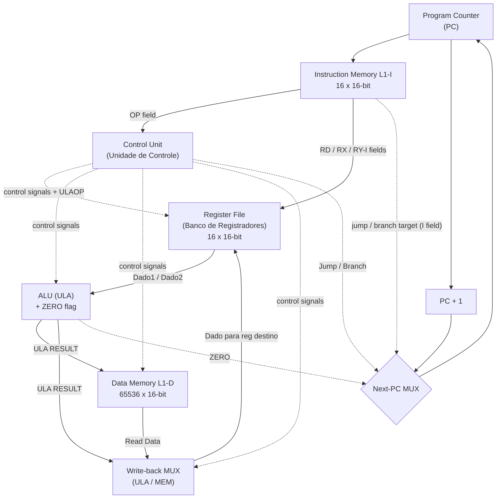
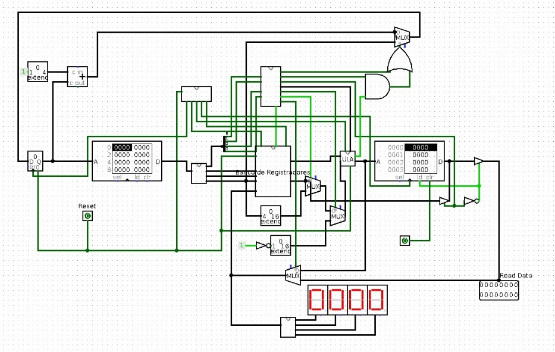
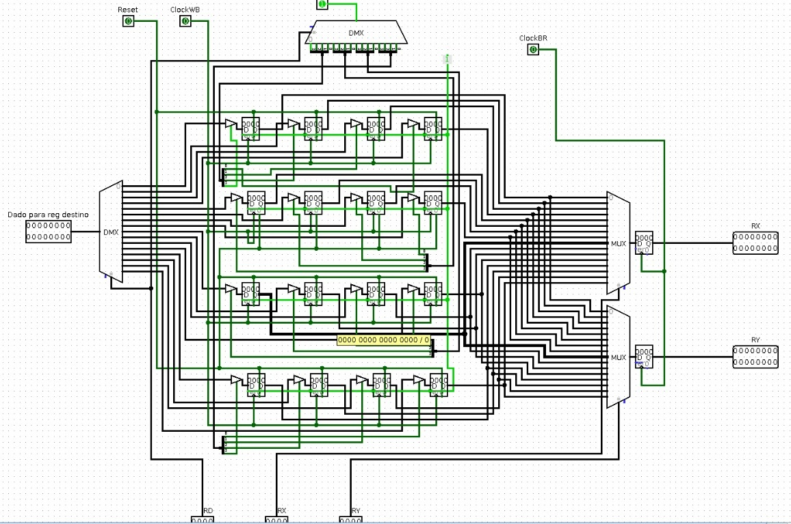
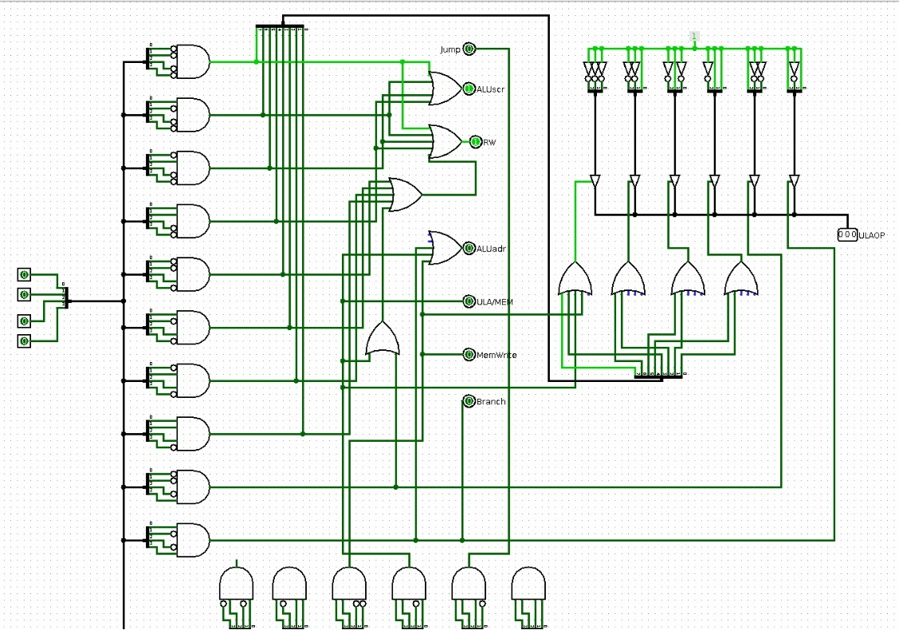
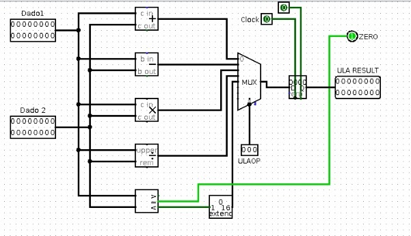
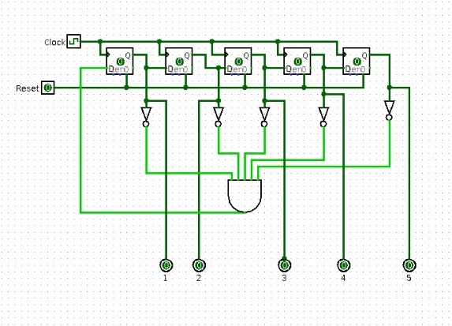

# Architecture Overview

A block-level tour of the 16-bit MIPS-like RISC processor: the datapath, the next-PC path, and each hardware module in turn.

> **Scope.** This document describes the *block-level* architecture — what the major blocks are, how they connect, and what each one does. For the instruction encoding and per-instruction behavior see [ISA](isa.md); for the cycle-by-cycle timing of the 5-phase sequencer see [Microarchitecture](microarchitecture.md).

---

## 1. What this processor is

This is a **16-bit RISC processor in the spirit of MIPS**, designed and simulated in **Logisim (v2.7.1)**. It is a **multicycle** CPU: every instruction runs through a fixed sequence of machine phases driven by a **5-phase clock sequencer**, rather than completing in a single clock or overlapping in a pipeline.

The core numbers are deliberately small and uniform, which makes the design easy to reason about while re-learning it:

| Property | Value |
|---|---|
| Data word size | 16 bits |
| Instruction width | 16 bits (single fixed format) |
| General-purpose registers | 16 registers × 16 bits (`r0`..`r15`) |
| Execution model | Multicycle, 5 fixed phases per instruction |
| Opcodes | 4-bit OP field → 16 possible; 14 defined, 2 reserved |
| Instruction memory (L1-I) | 16 words × 16 bits |
| Data memory (L1-D) | 65536 words × 16 bits |

**Origin and tooling.** The project is an academic/hobby design authored by Igor Tomich (GitHub: GitScrider), released under the MIT license. The schematic lives in Logisim (`Processador.circ` is the main build; `Desenvolvendo.circ` is a development variant with the same sub-circuits rewired; `Registrador.circ` is a standalone register experiment). The forward plan targets the **Altera/Intel DE2-115** board (Cyclone IV E, device **EP4CE115F29C7**) using **Intel Quartus Prime Lite**, with hand-written SystemVerilog brought up module-by-module.

**A note on names.** The original schematic is labeled in Portuguese. This documentation uses the English terms but keeps the schematic names alongside them so the photos are easy to follow: **Banco de Registradores** (Register File), **ULA** (ALU), **Unidade de Controle** (Control Unit), **Conversor de Saída** (Output Converter).

---

## 2. Datapath block diagram

At the block level, data flows from the Program Counter through instruction fetch, decode, execute, memory, and write-back. In parallel, a **next-PC MUX** decides where the Program Counter goes next: the default `PC + 1`, an unconditional jump target, or a conditional branch target.



Solid arrows carry data; dashed arrows carry control. The next-PC MUX is steered by the Control Unit's `Jump` and `Branch` signals together with the ALU's `ZERO` flag: `Jump` selects the target unconditionally (`j`), while `Branch AND ZERO` selects the target for a taken `beqz`. Otherwise the MUX passes `PC + 1`.



---

## 3. Instruction format at a glance

Every instruction is 16 bits, split by a 16→4 splitter into four 4-bit fields. This is the single lens through which the datapath reads each word, so it is worth stating here (the full encoding lives in [ISA](isa.md)):

```
bit15 ........................................ bit0
[  OP (4)  ][  RD (4)  ][  RX (4)  ][  RY / I (4) ]
```

- **OP** — 4-bit opcode.
- **RD** — destination register selector.
- **RX** — first source register selector.
- **RY / I** — second source register (R-type) *or* a 4-bit immediate / branch-or-jump target (I-type / control-flow). Because this field is only 4 bits, immediates and jump/branch targets are limited to the range **0..15**.

> **[TO-VERIFY]** The exact field endianness — whether OP is the most-significant nibble (bits 15..12) or the least-significant nibble — is still to be confirmed during RTL bring-up, by co-simulating the Verilog testbench against the Logisim run. This document presents OP as the most-significant nibble (matching the left-to-right order of the ISA table), and the endianness should be treated as **to be confirmed during RTL bring-up**.

---

## 4. Module-by-module

### 4.1 Program Counter (PC)

The Program Counter holds the address of the instruction to run and drives the instruction memory. Because the instruction memory is only 16 words deep, the PC effectively uses **4 bits of address**.

Its default behavior is `PC ← PC + 1`, produced by a "+1" adder/extend block that feeds the PC through the next-PC MUX. Control flow overrides this: on `j` the PC loads the target (the `I` field); on `beqz` with `ZERO = 1` the PC also loads the target. The next-PC MUX chooses between `PC + 1` and the target based on `Jump` and `Branch AND ZERO`.

> **[TO-VERIFY]** The exact phase at which jump and branch commit the new PC is still to be confirmed during RTL bring-up. The designer recalls that `j` effectively resolves the PC update around phase 3–4 — after the register-bank step it diverts the program counter and skips the memory/write-back arithmetic path — but the precise commit phase should be traced against the `.circ` during bring-up.

### 4.2 Instruction Memory (L1-I)

The instruction memory is a Logisim RAM component configured with `addrWidth = 4` and `dataWidth = 16`, giving **16 words × 16 bits**. In practical terms, a program is **at most 16 instructions long**. Its contents are loaded from a `v2.0 raw` memory image file (for example, the `loop.mem` sample program) via Logisim's "Load Image".

Each fetched 16-bit word is split into the OP / RD / RX / RY-I fields described above: the OP field goes to the Control Unit, and the register-selector fields go to the Register File. The `I` field also feeds the next-PC MUX as the jump/branch target.

> **Naming note.** "L1-I" is used here as a convenient label for the instruction memory. In the current build it is a plain RAM component, not a cache hierarchy.

### 4.3 Register File (Banco de Registradores)

The register file holds the 16 general-purpose registers. In Logisim it is built as a **4×4 grid of 16 D-flip-flop registers**, each 16 bits wide.

Reads and writes are selector-driven. Two **read MUXes** output the registers chosen by `RX` and `RY` (the ALU operands `Dado1` and `Dado2`). A write **DEMUX** ("DMX") routes the write-back datum — labeled "Dado para reg destino" ("data for destination register") on the schematic — to the register chosen by `RD`.

The observed control and clock inputs are `Reset`, `ClockWB` (the write-back write strobe) and `ClockBR` (the register-bank read/latch strobe), plus the 4-bit selector inputs `RD`, `RX`, and `RY`. The write only happens when write-back is enabled (see `WriteBack / RW` in the Control Unit).



### 4.4 Control Unit (Unidade de Controle)

The Control Unit turns the 4-bit opcode into the control signals that steer the rest of the datapath. A 4-bit opcode enters a decoder (AND gates + inverters, effectively a 4-to-N decoder); the decoded lines are then OR-combined to produce the individual control signals and the 3-bit `ULAOP`.

The control outputs observed on the schematic are: `Jump`, `ALUscr`, `RW` (register write / write-back), `ALUadr`, `ULA/MEM`, `MemWrite`, `Branch`, and `ULAOP[2:0]`. Their meanings:

- **ALUscr** (ALU source): `0` → ALU operand 2 is register `RY`; `1` → ALU operand 2 is the extended immediate `I`.
- **WriteBack / RW**: `1` → write the write-back datum into register `RD`.
- **MemULA / ULA/MEM** (mem-to-reg): `1` → write-back datum comes from the data-memory read (`lw`); `0` → from the ALU.
- **MemWrite**: `1` → write to data memory (`sw`).
- **Branch**: together with `ZERO` from the ALU, conditionally loads the PC with the target (`beqz`).
- **Jump**: unconditionally loads the PC with the target (`j`).
- **ALUadr**: asserted for `beqz`, `sw`, and `lw` (the memory/branch class).

> **[TO-VERIFY]** The exact role of `ALUadr` is still to be confirmed during RTL bring-up. Best current understanding: it steers the ALU output onto the data-memory address path / branch-compare path rather than the arithmetic write-back path. This should be confirmed by tracing the `.circ` during bring-up.

The full opcode → control-signal mapping (14 defined opcodes, 2 reserved) is reproduced in [ISA](isa.md); the summary is that immediate arithmetic (`addi`/`subi`/`muli`/`divi`) sets `ALUscr = 1` and `WriteBack = 1`, register arithmetic (`add`/`sub`/`mul`/`div`/`slt`) sets `WriteBack = 1` with `ALUscr = 0`, `lw` uses `MemULA = 1`, `sw` uses `MemWrite = 1`, `beqz` uses `Branch = 1`, and `j` uses `Jump = 1`.



### 4.5 ALU (ULA)

The ALU — "ULA" on the schematic — takes two 16-bit inputs, `Dado1` and `Dado2`, and produces a 16-bit `ULA RESULT` output plus a `ZERO` flag.

The schematic contains a full set of function blocks: an **adder** (`+`, with carry in/out), a **subtractor** (with borrow in/out), a **multiplier** (`×`), a **divider** (quotient "upper" / remainder "rem"), and a **magnitude comparator "A<Y"** for set-less-than, whose output passes through a sign-extend. A MUX selects the active result according to the 3-bit **ULAOP** select from the Control Unit, and the selected result passes through a **clocked output register** before it becomes `ULA RESULT`. The `ZERO` flag drives the branch logic for `beqz`.

The ULAOP encoding:

| ULAOP | Operation | Used by |
|---|---|---|
| `000` | add | `add`, `addi` |
| `001` | subtract | `sub`, `subi` |
| `010` | multiply | `mul`, `muli` |
| `011` | divide | `div`, `divi` |
| `100` | set-less-than (slt) | `slt` |
| `101` | subtract for ZERO | `beqz` (compare-to-0) |

> **Hardware-reality note (documented honestly).** Multiply and especially divide cannot complete in a single clock in real hardware. In Logisim these use the built-in Arithmetic blocks that "just work" in one simulation step. On the FPGA they will become either combinational (multiply → DSP blocks, tolerable) or genuinely multi-cycle (divide → iterative). This is a known limitation to address during RTL bring-up.



### 4.6 Data Memory (L1-D)

The data memory is a Logisim RAM component with `addrWidth = 16` and `dataWidth = 16`, giving **65536 words × 16 bits**. It is accessed by the two memory instructions: `sw` writes `reg[RData]` to `DataMem[reg[Radd]]` (asserting `MemWrite`), and `lw` reads `DataMem[reg[Radd]]` into `RD` (routed to write-back via `MemULA = 1`). Like the instruction memory, it is a plain RAM component in the current build, with contents loaded through Logisim's "Load Image".

> **On the immediate extension.** The schematic includes a sign/zero "extend" block on the immediate path. **[TO-VERIFY]** whether the 4-bit immediate is sign-extended or zero-extended is still to be confirmed during RTL bring-up — present this as configurable until then.

### 4.7 Five-phase Clock Sequencer

The sequencer is what makes this a multicycle machine. It is a **ring counter built from 5 D-flip-flops** in a one-hot arrangement, with a reset AND-gate, generating **5 non-overlapping machine phases** per instruction (outputs labeled 1..5):

1. **Phase 1 — PC**: present/update the Program Counter to the instruction memory.
2. **Phase 2 — Fetch/Decode**: read the instruction; the Control Unit decodes the opcode; the Register File reads `RX` and `RY` (`ClockBR`).
3. **Phase 3 — Execute**: the ALU computes; the ALU output register is clocked; `ZERO` is produced.
4. **Phase 4 — Memory**: data-memory access for `lw` (read) / `sw` (write).
5. **Phase 5 — Write-back**: write the result into register `RD` (`ClockWB`); the PC is updated (`PC + 1` or the branch/jump target).

Instructions that do not need a given stage still pass through it — the phase count is fixed at 5 for every instruction. The distinct clock strobes seen elsewhere in the datapath derive from these phases: `ClockBR` (register read, ~phase 2), the ALU output-register clock (~phase 3), `ClockWB` (register write-back, ~phase 5), and the PC clock (~phase 1 / phase 5 update). The exact cycle-by-cycle walkthrough is covered in [Microarchitecture](microarchitecture.md).



### 4.8 Output Converter / 7-segment display (Conversor de Saída)

For visualization, the top level exposes a `Read Data` output and a **4-digit 7-segment display** ("0000"), fed through a **"Conversor de Saída"** (Output Converter) sub-circuit. This converts a register/result value into the digit patterns shown on the display, so a value produced inside the datapath can be observed directly on the top-level schematic.

---

## 5. Where to go next

- **[ISA](isa.md)** — the full instruction set: the 16-bit encoding, every opcode, the control-signal table, and per-instruction semantics.
- **[Microarchitecture](microarchitecture.md)** — the multicycle timing detail: how the 5-phase sequencer drives each block cycle by cycle, and how jump/branch commit the PC.

---

*This overview is written from the project design brief. Items marked **[TO-VERIFY]** are open questions to be confirmed during RTL bring-up (module-by-module SystemVerilog on the DE2-115) and should not be treated as settled until then.*
