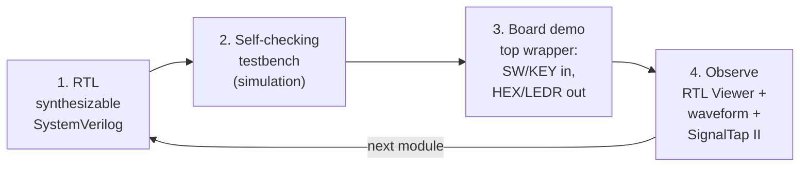
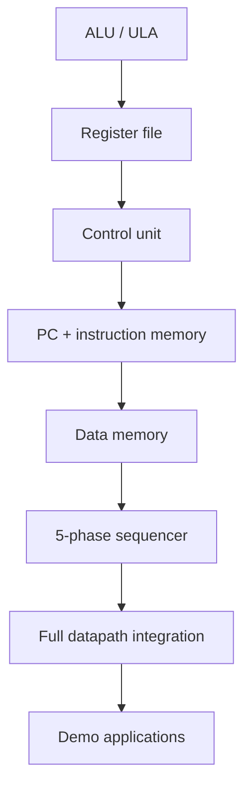
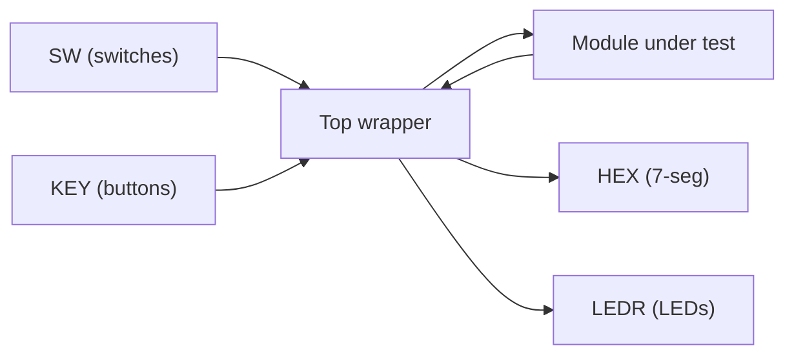

# FPGA Bring-Up Methodology (DE2-115)

> How we take the Logisim design and grow it, one module at a time, into synthesizable SystemVerilog running on real hardware — with a self-checking testbench and a small board demo at every step.

This document describes the **methodology** for bringing the 16-bit MIPS-like processor onto an FPGA. The RTL is not yet built; what follows is the plan we commit to and the reasoning behind it. For the verification strategy that underpins each step, see [verification.md](verification.md). For sequencing across the whole project, see [roadmap.md](roadmap.md). For the instruction set the RTL must implement, see [isa.md](isa.md).

---

## 1. Target platform

| Item | Value |
|------|-------|
| Board | Altera/Intel DE2-115 |
| FPGA family | Cyclone IV E |
| Device | EP4CE115F29C7 |
| Toolchain | Intel Quartus Prime Lite |
| Source language | Hand-written synthesizable SystemVerilog |
| Design under bring-up | 16-bit multicycle RISC CPU, 5-phase sequencer |

The DE2-115 gives us the physical I/O we lean on for every demo: slide switches (**SW**) and push-buttons (**KEY**) as inputs, 7-segment displays (**HEX**) and the red LED bank (**LEDR**) as outputs. These map naturally onto the design's own I/O idea — the top level already drives a 4-digit 7-segment display through a "Conversor de Saida" (output converter) to visualize a register or result value.

---

## 2. Why hand-write SystemVerilog instead of exporting from Logisim

Logisim (v2.7.1 / Evolution) is where the processor was designed, drawn, and simulated. It remains the **reference model** — the thing new RTL is checked against. But we do not export it to hardware. We re-author the design as synthesizable SystemVerilog by hand. The reasons:

- **Learning is the point.** This is an academic/hobby project, and the goal of the bring-up is for the designer to *re-learn their own design* block by block. Hand-writing each module forces a real understanding of what every wire does — something an automatic export would paper over.
- **Logisim exports are not built for synthesis.** A schematic-to-HDL dump tends to produce structural netlists that are hard to read, hard to constrain for timing, and awkward to debug on real silicon. Hand-written RTL is idiomatic, reviewable, and formally verifiable.
- **Some Logisim behavior is not physically real.** The clearest example is arithmetic: Logisim's built-in Arithmetic blocks make multiply and divide "just work" in a single simulation step. That is not achievable in one clock on an FPGA (see [Section 8](#8-the-multiplydivide-timing-limitation)). Re-authoring by hand is exactly where we confront and fix that gap.
- **It lets us verify honestly.** Hand-written RTL can carry self-checking testbenches and formal assertions (see [verification.md](verification.md)). We *want* the RTL to be an independent implementation so that co-simulating it against the Logisim run is a meaningful cross-check — not a tautology.

In short: Logisim is the specification and the oracle; the SystemVerilog is a fresh, honest, synthesizable implementation we can trust on hardware.

---

## 3. The module-by-module bring-up loop

We bring the design up **one module at a time**, never integrating a block we have not exercised in isolation first. Each module goes through the same four-part loop before it is considered "done."

**Step 1 — RTL.** Write the module as clean, synthesizable SystemVerilog, implementing the behavior specified in the brief and the ISA. Keep the interface small and explicit.

**Step 2 — Self-checking testbench.** Every module ships with its own testbench that drives inputs and *asserts* expected outputs, so a pass/fail is automatic rather than eyeballed from a waveform. This is the first gate. Tooling and technique are covered in [verification.md](verification.md).

**Step 3 — A small board demo.** We build a minimal **top wrapper** that exposes the module on the DE2-115:

- **Inputs** come from **SW** (slide switches, for operands / data values) and **KEY** (push-buttons, for actions like "step," "load," or operation-select).
- **Outputs** go to **HEX** (7-segment displays, to show a numeric result) and **LEDR** (the red LEDs, for flags, one-hot phase state, or status bits).

The demo is deliberately tiny — just enough to prove the module does something visible and correct when clocked by real hardware.

**Step 4 — Observe.** We look at the module through three complementary lenses:

| Lens | What it shows | When |
|------|---------------|------|
| **RTL Viewer** (Quartus) | The synthesized schematic — does the elaborated structure match what we intended? Catches accidental latches, wrong widths, unconnected nets. | After compile, before hardware |
| **Simulation waveform** (ModelSim-Intel / GTKWave) | Cycle-by-cycle signal behavior against the testbench stimulus. | During Step 2 |
| **SignalTap II** logic analyzer | The *real* signals captured live on the DE2-115 while the demo runs. The ground truth. | On hardware, Step 3 |

Only when a module passes all four steps do we move on. This keeps every regression local: if integration later misbehaves, we already trust the pieces.

---

## 4. Recommended module order

We build from the most self-contained, easiest-to-verify block toward full integration, then applications. Each arrow means "verified in isolation before starting the next."

| # | Module | Why here / what to prove |
|---|--------|--------------------------|
| 1 | **ALU (ULA)** | Purely combinational (mostly) and the richest single block: add, sub, mul, div, set-less-than, and the ZERO flag selected by the 3-bit **ULAOP**. Easy to test exhaustively; forces us to confront the multiply/divide timing issue early. |
| 2 | **Register file** | 16 × 16-bit registers with a write DEMUX (routed by RD) and two read MUXes (RX, RY). Introduces the write-back and read strobes (`ClockWB`, `ClockBR`). Read-after-write correctness is a headline property. |
| 3 | **Control unit** | The 4-bit opcode decoder producing the control signals and the 3-bit ULAOP per the authoritative control table. Best verified against that table directly. |
| 4 | **PC + instruction memory** | The 16-word (addrWidth=4) instruction memory plus the program counter: PC+1 by default, or load target on jump/branch. Small and finite, so easy to walk through. |
| 5 | **Data memory** | The load/store memory (lw/sw). Kept separate so its read/write timing is understood before it joins the datapath. |
| 6 | **5-phase sequencer** | The one-hot ring of 5 flip-flops generating the non-overlapping machine phases and the derived clock strobes. "Always exactly one-hot" is a prime formal property. |
| 7 | **Full datapath integration** | Wire the verified modules together into the complete multicycle CPU and re-run end-to-end checks, including co-simulation against the Logisim reference. |
| 8 | **Applications** | The three board demos (Section 6) that show the finished CPU doing something meaningful. |

Rationale for starting at the ALU and ending at integration: the ALU has zero dependencies and the most to learn; the sequencer ties everything together and is only meaningful once the blocks it strobes exist; integration and apps naturally come last. This ordering also front-loads the hardest hardware-reality question (mul/div timing) so it does not surprise us at integration time.

---

## 5. Per-module top wrapper convention

Each board demo is a thin top module that adapts the DE2-115 I/O to the module under test. The pattern is always the same:

- **SW** feed data/operand bits into the module.
- **KEY** provide edge events — step the clock, latch an input, or select an operation. (Debouncing/edge-detection lives in the wrapper, not the module.)
- **HEX** show a numeric result via the output-converter idea already present in the design's "Conversor de Saida."
- **LEDR** surface flags and internal state — the ZERO flag, the one-hot sequencer phase, write strobes, or a status bit.

Keeping the wrapper thin means the *module* stays synthesizable and reusable across simulation, formal, and hardware without change.

---

## 6. The three demo applications

All three are built incrementally, after full integration, to exercise the CPU end-to-end on the board.

### 6.1 Interactive ALU calculator
- **SW** = the two operands.
- **KEY** = choose the operation (mapping onto the ULAOP-selected functions).
- **HEX** = the result.

A direct, tactile way to confirm the ALU behaves correctly on hardware and to demonstrate each operation, including the ones with timing caveats (mul/div).

### 6.2 Nested-loop visualizer
- Runs the sample program `loop.mem`.
- Shows the loop counters on **LEDR**/**HEX**.
- **KEY** single-steps execution so you can watch the control flow phase by phase.

The brief describes `loop.mem` as a nested-loop demo (a for-inside-a-while shape) built from `j`, `slt`, and `beqz`. The exact instruction-by-instruction decode depends on the instruction-field endianness and is **to be confirmed during RTL bring-up** — so this demo is also where we validate that decode by co-simulating against Logisim. Until then we describe it only as "a nested-loop demo using `slt`/`beqz`/`j`," not as a settled byte-by-byte program.

### 6.3 Arithmetic sequence
- An assembly program that computes a numeric sequence (for example a table or Fibonacci-style series).
- Results shown on **HEX**.

Demonstrates the full fetch-decode-execute-memory-write-back path over many instructions and shows the CPU running a "real" program.

---

## 7. Quartus project workflow (checklist)

A repeatable checklist for standing up (or refreshing) the Quartus Prime Lite project for any module demo or the full CPU:

- [ ] **Create the project.** New project in Quartus Prime Lite; give it a name and working directory under `fpga/`.
- [ ] **Add RTL.** Add the module's SystemVerilog source(s) and the top wrapper to the project.
- [ ] **Set the device.** Select family **Cyclone IV E**, device **EP4CE115F29C7** (the DE2-115's FPGA).
- [ ] **Assign pins.** Map the top wrapper's ports (SW / KEY / HEX / LEDR and the clock) to physical pins via the `.qsf` (Quartus Settings File) or the **Pin Planner**. Use the DE2-115 board's documented pin assignments — *this document does not specify pin numbers; take them from the board reference so nothing is invented.*
- [ ] **Compile.** Run full compilation (analysis & synthesis, fitter, timing, assembler). Fix any warnings that indicate real problems (inferred latches, width mismatches, unconstrained clocks).
- [ ] **Inspect** the elaborated design in the **RTL Viewer** and review the timing summary.
- [ ] **Program.** Download the `.sof` to the board over the **USB-Blaster** (JTAG) using the Programmer.
- [ ] **Observe on hardware.** Bring up **SignalTap II** to capture live signals and confirm behavior against the testbench expectations.

> Pin assignments are board-specific. Where exact pin numbers are needed, consult the DE2-115 board documentation and record them in the project `.qsf`. We deliberately do **not** hard-code pin numbers in this methodology doc.

---

## 8. The multiply/divide timing limitation

This is the most important hardware-reality caveat, and we call it out honestly.

In Logisim, the ALU's multiply (`×`) and divide (quotient/remainder) use built-in Arithmetic blocks that complete in a single simulation step. **Real hardware cannot do this in one clock.** So during RTL bring-up:

| Operation | FPGA approach | Note |
|-----------|---------------|------|
| **Multiply** (`mul`, `muli`) | Combinational, mapped to the Cyclone IV E **DSP blocks** | Tolerable — the DSP hardware can do the multiply, though it must fit inside the phase timing. |
| **Divide** (`div`, `divi`) | **Multi-cycle / iterative** | Cannot be single-cycle; needs an iterative divider that spans multiple clocks. |

This is a **known limitation to resolve during RTL bring-up**, and it is a large part of why we start the module order at the ALU: we want to meet this problem first, decide how mul maps to DSP and how div becomes multi-cycle, and make sure the 5-phase sequencer's timing accommodates whatever the divider needs — well before integration.

---

## 9. Items to confirm during bring-up

Several facts from the design brief are explicitly **not yet settled** and must stay marked as *to be confirmed during RTL bring-up*. They directly affect the RTL and the demos:

| Topic | Open question | How it will be confirmed |
|-------|---------------|--------------------------|
| Instruction-field endianness | Is **OP** the most-significant nibble (bit15..12) or the least-significant nibble? Docs present OP as the most-significant nibble pending confirmation. | Co-simulate the SystemVerilog testbench against the Logisim run. |
| Immediate extension | Is the 4-bit immediate **sign-** or **zero-**extended? (An extend block exists on the schematic.) | Treat as configurable; confirm during bring-up. |
| `ALUadr` role | Exact function of the `ALUadr` control signal (best current understanding: steers the ALU output toward the data-memory address / branch-compare path). | Trace the `.circ` during bring-up. |
| Jump/branch commit phase | Exact machine phase at which `j` / `beqz` commit the new PC (recalled as roughly phase 3–4 for jump). | Confirm from the sequencer RTL and waveforms. |
| `loop.mem` decode | The exact instruction-by-instruction decode (depends on endianness above). | Annotate only after co-simulation; described as a nested-loop demo until then. |

None of these should be presented as final in downstream docs until confirmed.

---

## 10. Where this connects

- **[verification.md](verification.md)** — the simulation, formal (SymbiYosys + SVA), and on-hardware (SignalTap II) verification strategy that fills in Steps 2 and 4 of the bring-up loop.
- **[roadmap.md](roadmap.md)** — how the module order and the three apps fit into the overall project timeline.
- **[isa.md](isa.md)** — the instruction set, control table, and per-instruction semantics the RTL must implement.

---

*Part of the 16-bit MIPS-like RISC processor project. Target board: Altera/Intel DE2-115 (Cyclone IV E, EP4CE115F29C7). License: MIT.*
