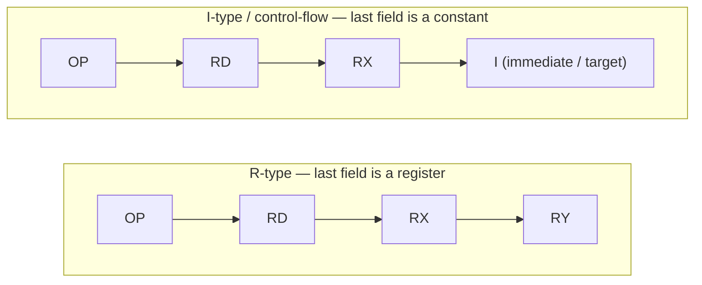

# Instruction Set Architecture (ISA) Reference

> The complete programmer-visible contract for the 16-bit MIPS-like RISC processor: instruction format, opcode map, per-instruction semantics, and the control signals each opcode drives.

This document is the authoritative ISA reference for the processor. It describes what each instruction does and how it is encoded into a single 16-bit word. For the datapath and timing that execute these instructions, see [Architecture](architecture.md); for how to write and assemble programs, see [Programming Guide](programming.md).

Related docs:

- [Architecture](architecture.md) — datapath, register file, ALU (ULA), control unit, memories, and the 5-phase multicycle timing.
- [Programming Guide](programming.md) — writing, assembling, and loading programs (including the `loop.mem` demo).

---

## 1. Overview

The processor is a **16-bit RISC** design in the spirit of MIPS. A few properties shape the entire ISA:

- **Word size:** 16 bits.
- **Instruction width:** a single, fixed **16-bit** width for every instruction.
- **Registers:** 16 general-purpose registers (`r0`..`r15`), 16 bits each.
- **Opcode space:** 4-bit opcode → 16 possible opcodes; **14 are defined, 2 are reserved**.
- **Immediates and branch/jump targets:** only **4 bits** wide, so they range **0..15**.

Because the design is **multicycle** (driven by a 5-phase clock sequencer), every instruction shares the same fixed encoding regardless of how many phases it actually uses. The encoding below is the single format the hardware splits and decodes.

---

## 2. Instruction format

Every instruction is 16 bits, split into **four 4-bit fields**. This split is confirmed by a 16→4 bit splitter present in the Logisim `.circ` source.

```
bit15 ........................................ bit0
[  OP (4)  ][  RD (4)  ][  RX (4)  ][  RY / I (4) ]
```

| Field | Width | Meaning |
|-------|-------|---------|
| **OP** | 4 bits | Opcode. 16 possible values; 14 defined, 2 reserved. |
| **RD** | 4 bits | Destination register selector (`r0`..`r15`). |
| **RX** | 4 bits | First source register selector. |
| **RY / I** | 4 bits | Second source register selector (**R-type**) **or** a 4-bit immediate / branch-or-jump target (**I-type / control-flow**). |

The three register-selector fields (RD, RX, RY) are each 4 bits, which is exactly enough to name one of the 16 registers. The last field does double duty: for register-to-register (R-type) instructions it selects the second source register `RY`; for immediate and control-flow instructions it carries a 4-bit constant `I` (an operand for arithmetic, or a target address for branches and jumps).

### Two shapes of instruction



### Endianness caveat — **[TO-VERIFY]**

The exact **field endianness** is **to be confirmed during RTL bring-up**. Specifically: it is not yet settled whether OP is the *most-significant* nibble (bits 15..12) or the *least-significant* nibble, and the byte-accurate decode of the sample program `loop.mem` depends on this. This will be confirmed by co-simulating the Verilog testbench against the Logisim run.

Throughout this document, OP is presented as the **most-significant nibble** — matching the left-to-right order of the opcode table below. Treat this ordering as the working assumption, not a settled fact, until bring-up confirms it. Every hand-encoded example in [Section 8](#8-hand-encoding-examples-illustrative) inherits the same caveat.

---

## 3. Opcode table

Opcodes `0x0`..`0xD` are defined (14 instructions). Opcodes `0xE` and `0xF` are **reserved** free opcodes held for future use.

| OP (hex) | Mnemonic | Type | Operand format (OP RD RX RY/I) |
|:--------:|----------|------|--------------------------------|
| `0x0` | `ctrl` | control | no-op / control |
| `0x1` | `addi` | I-type | `OP RD RX I` |
| `0x2` | `subi` | I-type | `OP RD RX I` |
| `0x3` | `muli` | I-type | `OP RD RX I` |
| `0x4` | `divi` | I-type | `OP RD RX I` |
| `0x5` | `add`  | R-type | `OP RD RX RY` |
| `0x6` | `sub`  | R-type | `OP RD RX RY` |
| `0x7` | `mul`  | R-type | `OP RD RX RY` |
| `0x8` | `div`  | R-type | `OP RD RX RY` |
| `0x9` | `slt`  | R-type | `OP RD RX RY` |
| `0xA` | `beqz` | control-flow | `OP - RX I(target)` |
| `0xB` | `sw`   | memory | `OP - Radd RData` |
| `0xC` | `lw`   | memory | `OP RD Radd -` |
| `0xD` | `j`    | control-flow | `OP - - I(target)` |
| `0xE` | *(reserved)* | — | free opcode for future use |
| `0xF` | *(reserved)* | — | free opcode for future use |

A dash (`-`) in a format string marks a field the instruction does not use.

---

## 4. Per-instruction semantics

Each instruction below is described exactly as specified in the design brief. `reg[n]` denotes the contents of register `n`; `DataMem[a]` denotes the data-memory word at address `a`; `sext(I)` denotes the extended 4-bit immediate; `PC` is the program counter.

### Arithmetic — immediate (I-type)

- **`addi RD, RX, I`** — `RD = RX + sext(I)`
- **`subi RD, RX, I`** — `RD = RX - sext(I)`
- **`muli RD, RX, I`** — `RD = RX * sext(I)`
- **`divi RD, RX, I`** — `RD = RX / sext(I)`

### Arithmetic — register (R-type)

- **`add RD, RX, RY`** — `RD = RX + RY`
- **`sub RD, RX, RY`** — `RD = RX - RY`
- **`mul RD, RX, RY`** — `RD = RX * RY`
- **`div RD, RX, RY`** — `RD = RX / RY`

### Comparison

- **`slt RD, RX, RY`** — `RD = (RX < RY) ? 1 : 0` (set-less-than)

### Control flow

- **`beqz RX, target`** — `if (RX == 0) PC = target`. Implemented via an ALU subtract that produces the `ZERO` flag, with `Branch = 1`.
- **`j target`** — `PC = target` (unconditional jump).

### Memory

- **`sw Radd, RData`** — `DataMem[ reg[Radd] ] = reg[RData]` (store word).
- **`lw RD, Radd`** — `RD = DataMem[ reg[Radd] ]` (load word).

### Control / no-op

- **`ctrl`** — no-op / reserved control. All control signals are `0`.

> **Immediate extension — [TO-VERIFY]:** Whether the 4-bit immediate `I` is **sign-extended** or **zero-extended** is **to be confirmed during RTL bring-up**. A sign/zero "extend" block exists on the schematic; the semantics above are written with `sext(I)`, but the extension mode should be treated as configurable and confirmed during bring-up.

> **Hardware reality note:** In Logisim, `mul`/`muli` and `div`/`divi` use built-in Arithmetic blocks that complete in a single simulation step. In real hardware, multiply and especially divide cannot complete in one clock — on the FPGA these become combinational (multiply → DSP blocks, tolerable) or must be made multi-cycle (divide → iterative). This is a known limitation to address during RTL bring-up, not part of the abstract ISA contract.

---

## 5. Control-signal table

The control unit ("UNIDADE DE CONTROLE") decodes the 4-bit opcode into the control signals below plus the 3-bit `ULAop`. The table is reproduced exactly as specified by the designer.

Columns: `jump`, `branch`, `MemWrite`, `MemULA` (a.k.a. `ULA/MEM` = mem-to-reg for `lw`), `ALUadr`, `ULAop`, `WriteBack` (`RW`), `ALUscr`. The operand format is repeated on the right for convenience.

| hex | mnem | jump | branch | MemWrite | MemULA | ALUadr | ULAop | WriteBack | ALUscr | format (OP RD RX RY/I) |
|-----|------|------|--------|----------|--------|--------|-------|-----------|--------|------------------------|
| 0 | ctrl | 0 | 0 | 0 | 0 | 0 | 000 | 0 | 0 | (no-op / control) |
| 1 | addi | 0 | 0 | 0 | 0 | 0 | 000 | 1 | 1 | OP RD RX I |
| 2 | subi | 0 | 0 | 0 | 0 | 0 | 001 | 1 | 1 | OP RD RX I |
| 3 | muli | 0 | 0 | 0 | 0 | 0 | 010 | 1 | 1 | OP RD RX I |
| 4 | divi | 0 | 0 | 0 | 0 | 0 | 011 | 1 | 1 | OP RD RX I |
| 5 | add  | 0 | 0 | 0 | 0 | 0 | 000 | 1 | 0 | OP RD RX RY |
| 6 | sub  | 0 | 0 | 0 | 0 | 0 | 001 | 1 | 0 | OP RD RX RY |
| 7 | mul  | 0 | 0 | 0 | 0 | 0 | 010 | 1 | 0 | OP RD RX RY |
| 8 | div  | 0 | 0 | 0 | 0 | 0 | 011 | 1 | 0 | OP RD RX RY |
| 9 | slt  | 0 | 0 | 0 | 0 | 0 | 100 | 1 | 0 | OP RD RX RY |
| A | beqz | 0 | 1 | 0 | 0 | 1 | 101 | 0 | 0 | OP -  RX I(target) |
| B | sw   | 0 | 0 | 1 | 0 | 1 | 000 | 0 | 0 | OP -  Radd RData |
| C | lw   | 0 | 0 | 0 | 1 | 1 | 000 | 1 | 0 | OP RD Radd - |
| D | j    | 1 | 0 | 0 | 0 | 0 | 000 | 0 | 0 | OP -  -  I(target) |
| E | (reserved) | - | - | - | - | - | - | - | - | free opcode for future use |
| F | (reserved) | - | - | - | - | - | - | - | - | free opcode for future use |

### 5.1 Control-signal meanings

- **`ALUscr`** (ALU source) — selects ALU operand 2. `0` → operand 2 is register `RY`; `1` → operand 2 is the extended immediate `I`. (Asserted for the immediate arithmetic instructions `addi`/`subi`/`muli`/`divi`.)
- **`WriteBack` / `RW`** (register write) — `1` → write the write-back datum into register `RD`. (Asserted for every instruction that produces a result destined for a register: the arithmetic ops, `slt`, and `lw`.)
- **`MemULA` / `ULA/MEM`** (mem-to-reg) — chooses the source of the write-back datum. `1` → the datum comes from a data-memory read (`lw`); `0` → it comes from the ALU.
- **`MemWrite`** — `1` → write to data memory. Asserted only for `sw`.
- **`ALUadr`** — asserted for `beqz`, `sw`, and `lw` (the memory/branch class). **[TO-VERIFY]** its exact role is **to be confirmed during RTL bring-up**. Best current understanding: it steers the ALU output onto the data-memory address path / branch-compare path rather than the arithmetic write-back path. This will be confirmed by tracing the `.circ` during bring-up.
- **`Branch`** — together with the `ZERO` flag from the ALU, conditionally loads `PC` with the target. Asserted for `beqz`; the PC actually changes only when `Branch = 1` **and** `ZERO = 1`.
- **`Jump`** — unconditionally loads `PC` with the target. Asserted for `j`.
- **`ULAop`** — 3-bit ALU operation selector produced by the control unit. See [Section 6](#6-ulaop-encoding).

---

## 6. ULAOP encoding

The ALU ("ULA") holds several function blocks (adder, subtractor, multiplier, divider, and a set-less-than comparator). A MUX selects the active result according to the 3-bit **`ULAOP`** select. The selected result passes through a clocked output register before it becomes the `ULA RESULT`.

| ULAOP | Operation | Used by |
|:-----:|-----------|---------|
| `000` | add | `add`, `addi` |
| `001` | subtract | `sub`, `subi` |
| `010` | multiply | `mul`, `muli` |
| `011` | divide | `div`, `divi` |
| `100` | set-less-than (`slt`) | `slt` |
| `101` | subtract for `ZERO` | `beqz` (compare-to-zero) |

Encodings `110` and `111` are not assigned by any current instruction. Note that `beqz` uses a dedicated subtract mode (`101`) whose purpose is to drive the `ZERO` flag used by the branch logic, distinct from the arithmetic subtract (`001`) used by `sub`/`subi`.

---

## 7. Immediate and target range (0..15)

Because the `RY / I` field is only **4 bits** wide, every immediate value and every branch/jump target is constrained to the range **0..15**. This has real, practical consequences for programmers:

- **Immediate arithmetic is small-step.** `addi`, `subi`, `muli`, and `divi` can only apply a constant in `0..15` per instruction. Larger constants must be built up over multiple instructions or loaded from a register.
- **Jump and branch targets are direct instruction indices.** `j target` and `beqz RX, target` name an instruction address in `0..15` directly in the `I` field. This meshes exactly with the instruction memory, which holds **16 words** (addressed by 4 bits) — so any target in range can address any instruction in a full program.
- **A program is at most 16 instructions.** The instruction memory is `16 words × 16 bits`, so the 0..15 target range covers the entire program space with no addressing gap.
- **[TO-VERIFY] sign vs zero extension** (see [Section 4](#4-per-instruction-semantics)) determines how the 4-bit immediate maps into the 16-bit datapath for arithmetic. Whether `I` reaches negative effective values (sign-extended) or stays in `0..15` (zero-extended) is to be confirmed during RTL bring-up.

---

## 8. Hand-encoding examples (illustrative)

> **These examples are illustrative and pending endianness confirmation.** They assume OP is the most-significant nibble and the field order `OP | RD | RX | RY/I` reads left-to-right into bits `15..0`, exactly the working assumption from [Section 2](#2-instruction-format). If bring-up confirms a different field endianness, the nibble order of the final hex word will change accordingly. Register numbers are written in decimal (`r5` → `5` → nibble `0x5`).

### Example 1 — I-type: `addi r1, r2, 5`

Meaning: `r1 = r2 + sext(5)`.

| Field | OP | RD | RX | I |
|-------|:--:|:--:|:--:|:-:|
| Value | `addi` = `0x1` | `r1` = `1` | `r2` = `2` | `5` |
| Nibble | `1` | `1` | `2` | `5` |

Concatenated most-significant-nibble-first: `0x1125`.

### Example 2 — R-type: `add r3, r1, r2`

Meaning: `r3 = r1 + r2`.

| Field | OP | RD | RX | RY |
|-------|:--:|:--:|:--:|:--:|
| Value | `add` = `0x5` | `r3` = `3` | `r1` = `1` | `r2` = `2` |
| Nibble | `5` | `3` | `1` | `2` |

Concatenated most-significant-nibble-first: `0x5312`.

### Example 3 — control-flow with an unused field: `beqz r5, 3`

Meaning: `if (r5 == 0) PC = 3`. The `beqz` format is `OP - RX I(target)`, so the `RD` nibble is unused; it is shown as `0` here as a placeholder.

| Field | OP | RD (unused) | RX | I (target) |
|-------|:--:|:-----------:|:--:|:----------:|
| Value | `beqz` = `0xA` | `-` | `r5` = `5` | `3` |
| Nibble | `A` | `0` | `5` | `3` |

Concatenated most-significant-nibble-first: `0xA053`.

> Because the exact bit pattern written into an unused field is not fixed by the ISA, assemblers may emit `0` (as above) or another value there. The [Programming Guide](programming.md) will pin down the assembler's convention.

---

## 9. Quick reference

| Category | Instructions |
|----------|--------------|
| Immediate arithmetic | `addi`, `subi`, `muli`, `divi` |
| Register arithmetic | `add`, `sub`, `mul`, `div` |
| Comparison | `slt` |
| Control flow | `beqz`, `j` |
| Memory | `sw`, `lw` |
| Control / no-op | `ctrl` |
| Reserved | `0xE`, `0xF` |

For the hardware that runs these instructions — the register file, ALU/ULA, control unit, memories, program counter, and the 5-phase multicycle sequencer — continue to [Architecture](architecture.md). To start writing programs, see the [Programming Guide](programming.md).
