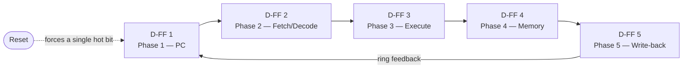
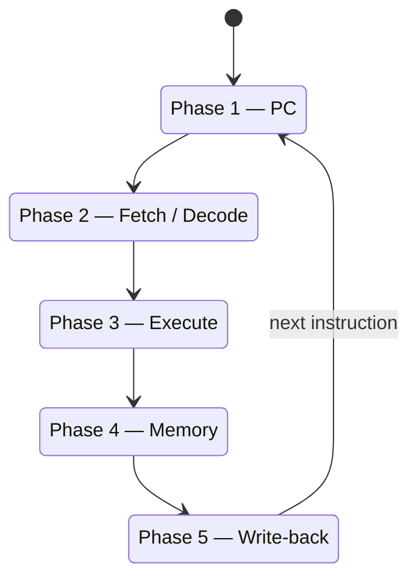
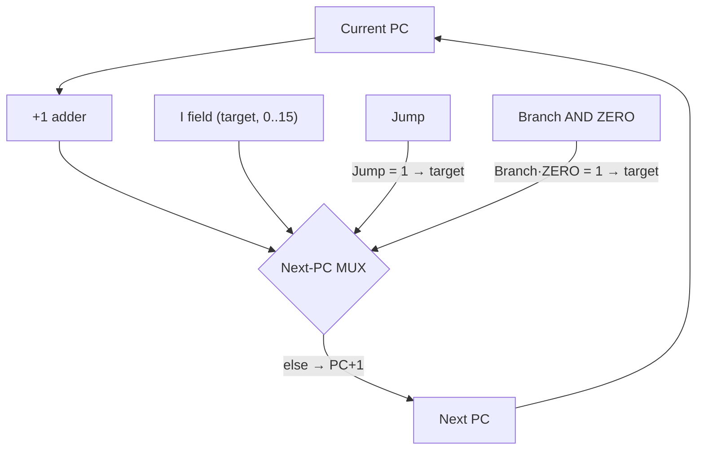

# Microarchitecture — Multicycle Timing and Control

> How the 16-bit RISC core turns one instruction into work: a fixed sequence of five machine phases, driven by a one-hot ring sequencer, with a handful of clock strobes that fire at the right moment in each phase.

This page focuses on *timing and control* — the "when" of the datapath. For the "what" (blocks, buses, memories, and how they connect), see [Architecture](architecture.md). For opcodes and instruction encoding, see the [ISA](isa.md).

---

## 1. Why multicycle? (vs. single-cycle and pipeline)

There are three classic ways to schedule the work of an instruction. It helps to see all three before diving into ours.

- **Single-cycle.** Every instruction finishes in exactly one clock tick. The clock period has to be long enough for the *slowest* instruction (typically a load, which threads through fetch → register read → ALU → memory → write-back all in one go). The control logic is simple, but the clock is stuck at the worst case, and expensive blocks (ALU, memories) sit idle most of the cycle.

- **Multicycle** *(this design)*. The work of one instruction is broken into several shorter steps, each occupying its own phase of a repeating cycle. Because each step is short, hardware can be reused across steps, and instructions that need fewer steps can, in principle, do less work. The cost is a small state machine — here, a **5-phase ring sequencer** — that walks the datapath through the steps in order. One instruction is fully retired before the next one begins.

- **Pipeline.** Steps of *consecutive* instructions are overlapped so that, ideally, one instruction completes every clock. This buys throughput but requires hazard handling (forwarding, stalls, flushes). **This processor is not pipelined** — it is deliberately multicycle to keep the control simple and easy to reason about while learning the design.

This core is a **multicycle** CPU: a fixed **five-phase** schedule per instruction, one instruction at a time.

---

## 2. The 5-phase ring sequencer

The heart of the timing is a **ring sequencer** built from **five D-flip-flops** wired in a loop, plus a **reset AND-gate** that guarantees a clean start. The five flip-flop outputs are labeled **1..5** and are **one-hot**: exactly one of them is `1` at any moment, and that single hot bit marches around the ring on each sequencer clock — `1 → 2 → 3 → 4 → 5 → 1 → ...`.

Each hot output *is* the enable for one machine phase. Because it is one-hot, the phases are **non-overlapping**: phase 3 cannot assert while phase 2 is still active. The reset AND-gate forces the ring back into a known state (a single hot bit in phase 1) so the machine never gets stuck with zero or multiple phases active.

The same idea, viewed as the cycle of states each instruction walks through:

**Fixed-length schedule.** This is a multicycle machine with a *fixed* five-phase cadence. Instructions that do not need a given step still pass through that phase — the phase simply does nothing useful for them. This keeps the sequencer trivial (a plain ring) at the cost of a few idle phases for the shorter instructions.

---

## 3. What happens in each phase

| Phase | Name | What the datapath does | Clock strobe(s) that fire |
|-------|------|------------------------|---------------------------|
| 1 | **PC** | Present / update the program counter to the instruction memory so the current instruction address is on the address bus. | PC clock (present) |
| 2 | **Fetch / Decode** | Read the instruction word from instruction memory. The Control Unit decodes the 4-bit opcode into its control signals and `ULAOP`. The register file reads the source registers selected by RX and RY. | `ClockBR` (register-bank read/latch) |
| 3 | **Execute** | The ALU ("ULA") computes according to `ULAOP`; the result is captured in the ALU output register, and the `ZERO` flag is produced. | ALU output register clock |
| 4 | **Memory** | Data-memory access: a read for `lw`, a write for `sw`. Non-memory instructions pass through idle. | (data-memory access; `MemWrite` asserted for `sw`) |
| 5 | **Write-back** | Write the result back into destination register RD (for instructions that produce one), and update the program counter — either PC+1 or a branch/jump target. | `ClockWB` (write-back), PC clock (update) |

A closer look at each:

### Phase 1 — PC
The program counter is presented to the 16-word instruction memory. Only 4 bits of address are meaningful (16 words → 16 instructions maximum). This is where the *current* PC drives the fetch that follows.

### Phase 2 — Fetch / Decode
Three things happen together:
1. **Fetch** — the addressed instruction word (16 bits) comes out of instruction memory.
2. **Decode** — the opcode (OP nibble) enters the Control Unit's decoder, which raises the control lines (`Jump`, `Branch`, `MemWrite`, `MemULA`/`ULA-MEM`, `ALUadr`, `WriteBack`/`RW`, `ALUscr`) and the 3-bit `ULAOP`.
3. **Register read** — the register file reads the registers selected by RX and RY, strobed by **`ClockBR`**.

### Phase 3 — Execute
The ALU takes its two operands — operand 2 is the register RY when `ALUscr = 0`, or the extended immediate I when `ALUscr = 1` — and computes the operation chosen by `ULAOP`. The selected result passes through a **clocked ALU output register** in this phase, and the **`ZERO`** flag (used by `beqz`) is produced here.

> **Immediate extension is [TO-VERIFY].** Whether the 4-bit immediate I is *sign*- or *zero*-extended before entering the ALU is still to be confirmed during RTL bring-up. Treat it as configurable until then.

### Phase 4 — Memory
Only the memory class does real work here:
- `lw` reads a word from data memory.
- `sw` writes a word to data memory (`MemWrite = 1`).

Every other instruction passes through this phase idle.

### Phase 5 — Write-back
Two independent updates:
- **Register write-back** — if `WriteBack`/`RW = 1`, the write-back datum is written into register RD, strobed by **`ClockWB`**. The datum is the ALU result when `MemULA = 0`, or the data-memory read when `MemULA = 1` (`lw`).
- **PC update** — the program counter advances (see [Next-PC selection](#5-next-pc-selection) below).

---

## 4. Clock strobes and where they fire

The multicycle schedule derives several distinct clock strobes from the phase outputs. The observed mapping is:

| Strobe | Fires approximately in | Job |
|--------|------------------------|-----|
| **PC clock** | phase 1 (present) and phase 5 (update) | Drive the current PC to instruction memory; latch the next PC. |
| **`ClockBR`** | phase 2 | Latch the register-file reads of RX and RY. |
| **ALU output register clock** | phase 3 | Capture the ALU result and the `ZERO` flag in the ALU output register. |
| **`ClockWB`** | phase 5 | Write the write-back datum into register RD. |

The tildes ("approximately") reflect that these strobes are *derived from* the phase lines; the phase-to-strobe alignment above is the current, observed understanding. The one timing detail that is explicitly still open is **when the PC actually commits for jumps and branches** — see the note in the next section.

---

## 5. Next-PC selection

The program counter can take one of three next values:

1. **Sequential:** `PC ← PC + 1` — the default. A "+1" adder / extend block feeds the PC through a MUX.
2. **Jump target:** `PC ← target` — on `j`, where `target` is the 4-bit I field (range 0..15).
3. **Branch-taken target:** `PC ← target` — on `beqz` **when `ZERO = 1`**, again using the 4-bit I field.

The **next-PC MUX** picks among these based on the control signals and the ALU flag:

- Select the **jump target** when `Jump = 1`.
- Select the **branch target** when `Branch = 1` **AND** `ZERO = 1` (the compare-to-zero succeeded).
- Otherwise select **PC + 1**.

The `ZERO` flag comes from the ALU: for `beqz`, `ULAOP = 101` selects a "subtract for ZERO" that compares RX against zero, and `Branch = 1` arms the conditional PC load. For an unconditional `j`, `Jump = 1` loads the target regardless of any flag.

> **[TO-VERIFY] — the exact phase in which jump and branch commit the new PC.**
> The designer recalls that `j` (jump) effectively resolves its PC update **around phase 3–4** — i.e. after the register-bank step it diverts the program counter, without needing the memory or write-back arithmetic path. The precise phase at which **jump and branch commit the new PC is still to be confirmed during RTL bring-up** (by co-simulating the Verilog testbench against the Logisim run). Until then, treat the phase-5 "PC update" description above as the nominal model and the phase-3–4 recollection for `j`/`beqz` as pending confirmation.

---

## 6. Per-instruction-class phase usage

The table below shows which phases are *meaningfully used* by each instruction class, and what happens in each. Phases that an instruction still passes through but does no useful work in are marked *(pass-through)*.

Classes follow the [control table](architecture.md): **R-type** = `add, sub, mul, div, slt`; **I-type** = `addi, subi, muli, divi`; plus `beqz`, `sw`, `lw`, and `j`.

| Class | Phase 1 — PC | Phase 2 — Fetch/Decode | Phase 3 — Execute | Phase 4 — Memory | Phase 5 — Write-back |
|-------|--------------|------------------------|-------------------|------------------|----------------------|
| **R-type** (`add/sub/mul/div/slt`) | Present PC | Fetch; decode; read RX and RY (`ClockBR`) | ALU computes RX ⊕ RY per `ULAOP`; latch result + `ZERO` | *(pass-through)* | Write ALU result → RD (`ClockWB`); `PC ← PC+1` |
| **I-type** (`addi/subi/muli/divi`) | Present PC | Fetch; decode; read RX; extend immediate I (`ALUscr = 1`) | ALU computes RX ⊕ sext/zext(I) per `ULAOP`; latch result | *(pass-through)* | Write ALU result → RD (`ClockWB`); `PC ← PC+1` |
| **`beqz`** | Present PC | Fetch; decode; read RX (`ClockBR`) | ALU "subtract for ZERO" (`ULAOP = 101`) compares RX to 0; produce `ZERO`; `Branch = 1` | *(pass-through)* | No register write; `PC ← target` if `ZERO = 1`, else `PC ← PC+1` † |
| **`sw`** | Present PC | Fetch; decode; read source registers (`ClockBR`) | ALU active; `ALUadr = 1` steers the address path ‡ | **Write** data memory (`MemWrite = 1`) | No register write; `PC ← PC+1` |
| **`lw`** | Present PC | Fetch; decode; read address register (`ClockBR`) | ALU active; `ALUadr = 1` steers the address path ‡ | **Read** data memory | Write memory data → RD (`ClockWB`, `MemULA = 1`); `PC ← PC+1` |
| **`j`** | Present PC | Fetch; decode (`Jump = 1`) | *(pass-through)* — designer recalls PC diverts around phase 3–4 † | *(pass-through)* | No register write; `PC ← target` † |

† **[TO-VERIFY]** — the exact phase at which `j` and `beqz` commit the new PC is still to be confirmed during RTL bring-up (see [Next-PC selection](#5-next-pc-selection)).

‡ **[TO-VERIFY]** — the exact role of `ALUadr` is still to be confirmed during RTL bring-up. Best current understanding: it steers the ALU output onto the data-memory address / branch-compare path rather than the arithmetic write-back path. It is asserted for `beqz`, `sw`, and `lw`.

A few things worth noticing in the table:

- **Every class uses phases 1 and 2** — fetch and decode are universal.
- **Only `lw` and `sw` use phase 4** (memory). Everyone else idles through it.
- **Only instructions with `WriteBack = 1` use the `ClockWB` write in phase 5** — that is R-type, I-type, and `lw`. `beqz`, `sw`, and `j` write no register.
- **`mul`/`div` are a known hardware caveat.** In Logisim the built-in arithmetic blocks compute multiply and divide in a single simulation step, which is why they fit the one-phase Execute slot here. On real FPGA hardware, divide in particular cannot finish in one clock and will need a multi-cycle (iterative) implementation. This is a limitation to address during RTL bring-up, not a property of the phase schedule.

---

## 7. Summary

- The core is **multicycle**: one instruction at a time, split across a **fixed 5-phase** schedule (not pipelined).
- Timing comes from a **one-hot ring sequencer** — five D-flip-flops in a loop plus a reset AND-gate — whose single hot bit marches `1 → 2 → 3 → 4 → 5` and back.
- The phases are **PC → Fetch/Decode → Execute → Memory → Write-back**, with strobes **PC clock**, **`ClockBR`**, **ALU output register clock**, and **`ClockWB`** firing at their respective phases.
- The next PC is chosen by a MUX among **PC+1**, **jump target** (`Jump`), and **branch target** (`Branch AND ZERO`), using the 4-bit I field as the target.
- The precise phase at which **jump/branch commit the PC**, the **role of `ALUadr`**, and the **sign-vs-zero immediate extension** all remain **to be confirmed during RTL bring-up**.

**See also:** [Architecture](architecture.md) · [ISA](isa.md)
