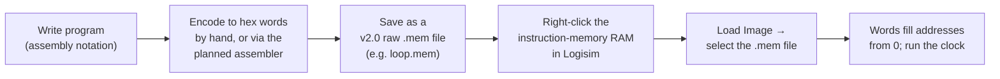

# Programming the 16-bit Processor

*How to write a program for this CPU, encode it, and load it into the instruction memory in Logisim.*

This guide is the practical companion to the [ISA reference](isa.md). The ISA reference explains
*what each instruction is*; this page explains *how to turn instructions into a runnable image* and
get that image into the simulator. If you are re-learning your own design after a break, start here
and keep the ISA reference open in a second tab.

---

## At a glance

| Topic | Value |
|-------|-------|
| Word size | 16 bits |
| Instruction width | 16 bits (fixed) |
| Registers | 16 general-purpose, 16 bits each: `r0`..`r15` |
| Instruction memory | 16 words × 16 bits → **max 16 instructions per program** |
| Immediate / branch / jump range | `0`..`15` (a single 4-bit field) |
| Program image format | Logisim **`v2.0 raw`** memory image (e.g. `loop.mem`) |
| How a program is loaded | Logisim RAM → right-click → **Load Image** |
| Assembler | planned, will live in `asm/` (not built yet) |

---

## The register set

The processor has **16 general-purpose registers**, each **16 bits** wide, named `r0` through
`r15`. In the Logisim schematic they are built as a 4×4 grid of 16 D-flip-flop registers.

Every register selector in an instruction — the destination `RD`, the first source `RX`, and the
second source `RY` — is a **4-bit field**, which is exactly enough to name one of the 16 registers
(`0000` = `r0` … `1111` = `r15`).

| Field | Width | Selects |
|-------|-------|---------|
| `RD` | 4 bits | destination register (write-back target) |
| `RX` | 4 bits | first source register |
| `RY` | 4 bits | second source register (R-type only) |

> The brief documents these 16 registers as general-purpose with no special-purpose conventions
> (for example, no documented hardwired-zero register). If a convention like that is added later, it
> will be recorded in the ISA reference — do not assume one exists yet.

---

## Instruction encoding (recap)

Every instruction is one 16-bit word, split into four 4-bit fields:

```
bit15 ........................................ bit0
[  OP (4)  ][  RD (4)  ][  RX (4)  ][  RY / I (4) ]
```

- **OP** — 4-bit opcode (16 possible codes; 14 defined, 2 reserved).
- **RD** — destination register selector.
- **RX** — first source register selector.
- **RY / I** — second source register (R-type) *or* a 4-bit immediate / branch-or-jump target
  (I-type and control-flow). Because this field is only 4 bits wide, **every immediate and every
  jump/branch target is in the range `0`..`15`.**

> **[TO-VERIFY] — field endianness.** Whether `OP` is the most-significant nibble (`bit15..12`) or
> the least-significant nibble has not yet been confirmed. Following the project brief, this doc
> presents `OP` as the **most-significant** nibble (matching the left-to-right order of the ISA
> table), but the exact byte order **is to be confirmed during RTL bring-up** by co-simulating the
> Verilog testbench against the Logisim run. Any concrete hex value shown below inherits that same
> caveat.

Full opcode assignments and control-signal semantics live in the [ISA reference](isa.md).

---

## Assembly syntax

The assembly notation below follows the operand forms defined in the design brief. Registers are
written `r0`..`r15`; immediates and targets are written as plain integers in `0`..`15`.

> **Note on the assembler.** A text assembler does not exist yet (see
> [The planned assembler](#the-planned-assembler)). The syntax here is the canonical notation used
> throughout the docs and the intended input shape for that future tool. Assembler-specific details
> that the brief does not define yet — comment characters, labels, directives — are deliberately not
> specified here so nothing is invented ahead of the implementation.

### Every instruction

| Hex `OP` | Mnemonic | Assembly form | Operation |
|:--------:|----------|---------------|-----------|
| `0` | `ctrl` | `ctrl` | no-op / reserved control (all control signals 0) |
| `1` | `addi` | `addi rD, rX, I` | `rD = rX + ext(I)` |
| `2` | `subi` | `subi rD, rX, I` | `rD = rX - ext(I)` |
| `3` | `muli` | `muli rD, rX, I` | `rD = rX * ext(I)` |
| `4` | `divi` | `divi rD, rX, I` | `rD = rX / ext(I)` |
| `5` | `add`  | `add rD, rX, rY` | `rD = rX + rY` |
| `6` | `sub`  | `sub rD, rX, rY` | `rD = rX - rY` |
| `7` | `mul`  | `mul rD, rX, rY` | `rD = rX * rY` |
| `8` | `div`  | `div rD, rX, rY` | `rD = rX / rY` |
| `9` | `slt`  | `slt rD, rX, rY` | `rD = (rX < rY) ? 1 : 0` |
| `A` | `beqz` | `beqz rX, target` | `if (rX == 0) PC = target` |
| `B` | `sw`   | `sw rAdd, rData` | `DataMem[reg[rAdd]] = reg[rData]` |
| `C` | `lw`   | `lw rD, rAdd` | `rD = DataMem[reg[rAdd]]` |
| `D` | `j`    | `j target` | `PC = target` |
| `E` | *(reserved)* | — | free opcode for future use |
| `F` | *(reserved)* | — | free opcode for future use |

`ext(I)` denotes the immediate after the schematic's extend block.

> **[TO-VERIFY] — immediate extension.** Whether the 4-bit immediate is **sign-extended** or
> **zero-extended** is not yet settled (a sign/zero "extend" block exists on the schematic). Treat
> `ext(I)` as configurable; the choice **will be confirmed during RTL bring-up.** Since the field
> is 4 bits, the raw immediate is always in `0`..`15` either way.

### Instruction classes

- **R-type** (`add`, `sub`, `mul`, `div`, `slt`): three register operands — `rD, rX, rY`.
- **I-type** (`addi`, `subi`, `muli`, `divi`): two registers and a 4-bit immediate — `rD, rX, I`.
- **Branch** (`beqz`): tests `rX` against zero and, if equal, sets `PC` to `target`.
- **Jump** (`j`): unconditionally sets `PC` to `target`.
- **Memory** (`lw`, `sw`): the register named as the address holds the **data-memory address**; its
  *contents* index `DataMem`, not the register number itself.
- **Control** (`ctrl`): a no-op; leaves all control signals at 0.

### How operands map onto the 16-bit word

Not every instruction uses all four fields. Unused nibbles are shown as `-` and carry no meaning
(conventionally left 0). This mapping comes straight from the control table in the brief:

| Mnemonic | `OP` | `RD` | `RX` | `RY / I` |
|----------|:----:|:----:|:----:|:--------:|
| `addi`/`subi`/`muli`/`divi` | opcode | `rD` | `rX` | `I` (immediate) |
| `add`/`sub`/`mul`/`div`/`slt` | opcode | `rD` | `rX` | `rY` |
| `beqz` | `A` | `-` | `rX` (tested) | `target` |
| `sw` | `B` | `-` | `rAdd` (address reg) | `rData` (data reg) |
| `lw` | `C` | `rD` | `rAdd` (address reg) | `-` |
| `j` | `D` | `-` | `-` | `target` |

**Branch and jump targets are absolute instruction addresses** in `0`..`15` — the value the program
counter is loaded with, not an offset. That range lines up exactly with the 16-word instruction
memory described below.

### Hand-assembling one instruction

Take `add r1, r2, r3`. Its four nibbles are:

| Field | `OP` | `RD` | `RX` | `RY` |
|-------|:----:|:----:|:----:|:----:|
| Value | `5` | `1` | `2` | `3` |

Reading `OP` as the most-significant nibble, the packed word is `0x5123`.

> This concrete value assumes `OP` is the most-significant nibble. If the endianness turns out to be
> the other way around (see the caveat above), the nibble *values* are unchanged but their order in
> the stored word flips. **The byte order is to be confirmed during RTL bring-up.**

---

## Program-size limit

The **instruction memory** is a Logisim RAM configured with `addrWidth = 4` and `dataWidth = 16` —
that is, **16 words of 16 bits each**. The program counter therefore uses 4 address bits.

**A program can contain at most 16 instructions.** There is no more room in instruction memory, and
the 4-bit target field can only name addresses `0`..`15`, so both the code and every jump/branch
target fit inside that same 16-slot window. Plan loops and branches to land within addresses
`0`..`15`.

(The **data memory** is a separate, much larger RAM — `addrWidth = 16`, so 65536 words × 16 bits —
used by `lw`/`sw`. Only *instruction* memory is capped at 16 words.)

---

## The `v2.0 raw` memory image format

Logisim loads and saves RAM/ROM contents as a plain-text **memory image**. The format used by this
project is Logisim's **`v2.0 raw`** format:

- The file begins with the exact header line `v2.0 raw`.
- After the header come the memory word values, separated by spaces or newlines.
- **Values are written in hexadecimal**, without a `0x` prefix.
- Words load into **consecutive addresses starting at 0**: the first value goes to address `0`, the
  next to address `1`, and so on. Addresses beyond the last listed value stay at their default (0).

That is the entire contract for a small program like ours — a header line followed by a list of hex
words. (Logisim also accepts a `count*value` run-length shorthand for long runs of a repeated value,
but the sample program does not use it.)

---

## Loading a program into the instruction RAM

The program image is loaded with Logisim's built-in **Load Image** action. The steps below use
Logisim 2.7.1 (classic); Logisim Evolution is equivalent.



1. Open the circuit (for example `Processador.circ`) in Logisim.
2. Find the **instruction-memory RAM** on the canvas — the RAM component sized 16 words × 16 bits
   (`addrWidth = 4`, `dataWidth = 16`). This is the one the program counter addresses.
3. **Right-click** that RAM component and choose **Load Image…**.
4. In the file chooser, select your `v2.0 raw` image (for example `logisim/programs/loop.mem`).
5. Logisim reads the header, then writes each hex word into consecutive addresses starting at `0`.
   The program is now in place; reset and step the clock to run it.

Two useful companions to Load Image:

- **Save Image** (also on the right-click menu) writes the current RAM contents back out in the same
  `v2.0 raw` format — handy for capturing a program you poked in by hand.
- The **data memory** is loaded through the exact same Load Image mechanism if you need to
  pre-populate it for `lw`/`sw` experiments.

---

## Sample program: `loop.mem`

The repository ships a sample image at `logisim/programs/loop.mem`. Its full contents are:

```
v2.0 raw
0 112 221 8312 9032 240 e003
```

That is 7 words, loaded into addresses `0`..`6` (hexadecimal):

| Address | Word |
|:-------:|:----:|
| 0 | `0x0000` |
| 1 | `0x0112` |
| 2 | `0x0221` |
| 3 | `0x8312` |
| 4 | `0x9032` |
| 5 | `0x0240` |
| 6 | `0xe003` |

**What it is:** a **nested-loop demo — a for-inside-a-while shape — built from `slt` / `beqz` / `j`.**
It exercises the comparison instruction, the conditional branch, and the unconditional jump together,
which is exactly what makes it a good first program to watch step through the 5-phase clock.

> **The exact, instruction-by-instruction decode of `loop.mem` is intentionally not published here.**
> Decoding each word into `OP / RD / RX / RY-I` depends on the field endianness, which is still
> **[TO-VERIFY]** (see the encoding caveat above). A confident byte-by-byte decode **is pending
> endianness confirmation during RTL bring-up** — it will be produced by co-simulating the Verilog
> testbench against the Logisim run and added once verified. Until then, rely on the high-level
> description (nested loops via `slt`/`beqz`/`j`) rather than a per-word breakdown.

---

## The planned assembler

Hand-encoding 16-bit words is fine for a 7-word demo, but it does not scale. A small **assembler is
planned and will live in the `asm/` directory**. Its job will be to take **readable assembly** — the
mnemonics and operand forms shown on this page — and emit a **`v2.0 raw` `.mem` image** ready for
Load Image. In short:

```
assembly source  ──►  asm/ assembler  ──►  program.mem (v2.0 raw)  ──►  Logisim Load Image
```

This tool does not exist yet. Its exact input syntax and command-line interface will be documented
here once it is built, and its output will follow the same `v2.0 raw` format described above so it
drops straight into the existing Load Image workflow.

---

## See also

- [ISA reference](isa.md) — opcodes, control signals, and per-instruction semantics.
- [Project README](../README.md) — project overview and repository layout.
