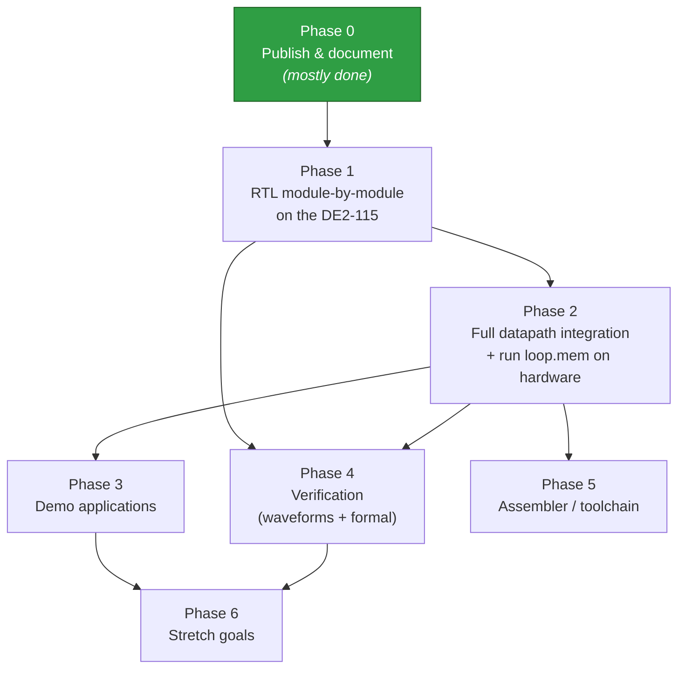
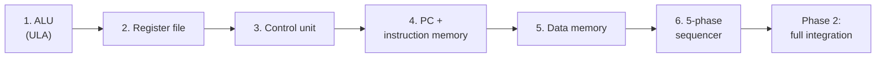
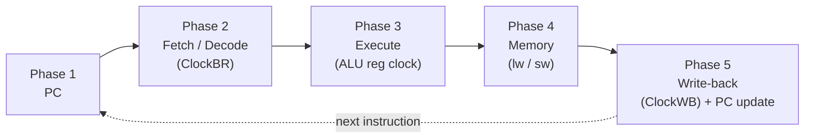

# Project Roadmap

> A phased, checkbox-driven plan to take the 16-bit MIPS-like RISC CPU from a Logisim design into hand-written SystemVerilog running on the Altera/Intel DE2-115 (Cyclone IV E, `EP4CE115F29C7`) — brought up module by module, then verified in simulation, on hardware, and formally.

This roadmap is a living checklist. Check items off as they land. Anything still uncertain about the original design is tracked explicitly in [Open questions to resolve during bring-up](#open-questions-to-resolve-during-bring-up) and stays marked *to be confirmed during RTL bring-up* until co-simulation settles it.

**Related docs:** [README](../README.md) · [ISA reference](isa.md) · [FPGA bring-up guide](fpga-bringup.md)

---

## At a glance

Verification (Phase 4) runs alongside the RTL work rather than strictly after it: each module gets a self-checking testbench as it is written, and formal properties are added as the design stabilizes.

---

## Phase 0 — Publish & document *(mostly done)*

Stand the project up as a clean, public, MIT-licensed repository with documentation a student can re-learn from.

- [x] Create the repository structure (`docs/`, `logisim/`, `rtl/`, `sim/`, `formal/`, `fpga/`, `asm/`)
- [x] Add the MIT `LICENSE`
- [x] Capture the original Logisim artifacts (`Processador.circ`, `Desenvolvendo.circ`, `Registrador.circ`) and the `loop.mem` sample program under `logisim/`
- [x] Add the five sub-circuit photos to `docs/images/` (`01-datapath-toplevel`, `02-banco-registradores`, `03-unidade-controle`, `04-ula`, `05-sequenciador-clock`)
- [x] Write the authoritative design brief (single source of truth)
- [ ] Finish the front-page `README.md` (what it is, how to read the docs, how to build)
- [ ] Complete the documentation set: ISA reference, microarchitecture / datapath, control-unit table, [FPGA bring-up guide](fpga-bringup.md), verification plan
- [ ] Add wiring/pinout notes as they are confirmed on the board

---

## Phase 1 — RTL, module by module on the DE2-115

Hand-write synthesizable SystemVerilog and bring each block up **on its own** before integration, so every module can be tested and understood in isolation. Tooling: Intel Quartus Prime Lite for synthesis on the `EP4CE115F29C7`; the original schematic reference is Logisim 2.7.1 / Logisim Evolution.

### Status — RTL + simulation (all verified in ModelSim ASE 10.1d)

| Module | RTL | Self-checking testbench | Result |
|---|---|---|---|
| ALU | [`alu.sv`](../rtl/alu.sv) | `alu_tb` | ✅ PASS — 2010 checks |
| Register file | [`regfile.sv`](../rtl/regfile.sv) | `regfile_tb` | ✅ PASS — 519 checks |
| Control unit | [`control.sv`](../rtl/control.sv) | `control_tb` | ✅ PASS — 16 (exhaustive) |
| Program counter | [`pc.sv`](../rtl/pc.sv) | `pc_tb` | ✅ PASS — 1015 checks |
| Instruction memory | [`imem.sv`](../rtl/imem.sv) | `imem_tb` | ✅ PASS — 16 checks |
| Data memory | [`dmem.sv`](../rtl/dmem.sv) | `dmem_tb` | ✅ PASS — 506 checks |
| 5-phase sequencer | [`sequencer.sv`](../rtl/sequencer.sv) | `sequencer_tb` | ✅ PASS — 16 checks |

So **RTL + testbench are done and green for all seven leaf blocks.** The remaining unchecked items in
the per-module lists below are the **FPGA board demo wrapper** and the **on-hardware observe note**;
integration is Phase 2. Run any module with `sim\run.ps1 <module>` (add `-Wave` for the waveform), and
learn the HDL behind each one in [hdl-basics.md](hdl-basics.md).

### Module bring-up order

The recommended order builds from leaf datapath blocks up to the timing that drives them:

### Definition of done for every module

Each module in this phase is only "done" when all four of these exist:

| Deliverable | What it means |
|-------------|---------------|
| **RTL** | Hand-written, synthesizable SystemVerilog for the block |
| **Testbench** | A self-checking testbench (Icarus Verilog / Verilator / ModelSim-Intel) |
| **Board demo** | A small top wrapper mapping the block to `SW` / `KEY` / `HEX` / `LEDR` on the DE2-115 |
| **Observe note** | How to watch it work: RTL Viewer, a waveform in ModelSim / GTKWave, and SignalTap II on hardware |

See the [FPGA bring-up guide](fpga-bringup.md) for the per-module wrapper and observation details.

### 1. ALU (ULA)

16-bit `Dado1` / `Dado2` inputs, a 16-bit `ULA RESULT`, and a `ZERO` flag. A MUX selects the active result by the 3-bit `ULAOP`; the selected result passes through a clocked output register.

| `ULAOP` | operation | used by |
|---------|-----------|---------|
| `000` | add | add, addi |
| `001` | subtract | sub, subi |
| `010` | multiply | mul, muli |
| `011` | divide | div, divi |
| `100` | set-less-than (slt) | slt |
| `101` | subtract for `ZERO` | beqz (compare-to-0) |

- [ ] RTL: adder, subtractor, multiplier, divider (quotient + remainder), set-less-than comparator with sign-extended output, result MUX by `ULAOP`, clocked output register, `ZERO` flag
- [ ] Decide multiply/divide implementation on FPGA — **multiply/divide cannot complete in one real clock**. In Logisim the built-in Arithmetic blocks "just work" in a single simulation step; on the FPGA multiply can map to DSP blocks (combinational, tolerable) while divide should become multi-cycle / iterative. Treat this as a known limitation to resolve here.
- [ ] Testbench: exhaustive/random checks per `ULAOP`, `ZERO` behavior for the subtract-for-zero path
- [ ] Board demo + observe note

### 2. Register file

16 registers × 16 bits (a 4×4 grid of 16 D-flip-flop registers in the original). A write DEMUX routes the write-back datum to the register chosen by `RD`; two read MUXes output the registers chosen by `RX` and `RY`.

- [ ] RTL: 16×16 register array, write DEMUX (by `RD`), two read MUXes (by `RX`, `RY`)
- [ ] Wire the observed control/clock inputs: `Reset`, `ClockWB` (write-back strobe), `ClockBR` (read/latch strobe); selectors `RD`, `RX`, `RY` (4 bits each)
- [ ] Testbench: read-after-write, independent read ports, reset behavior
- [ ] Board demo + observe note

### 3. Control unit (UNIDADE DE CONTROLE)

A 4-bit opcode enters a decoder; decoded lines are OR-combined into the control signals and the 3-bit `ULAOP`. Outputs observed on the schematic: `Jump`, `ALUscr`, `RW`, `ALUadr`, `ULA/MEM`, `MemWrite`, `Branch`, `ULAOP[2:0]`.

Authoritative control table (exactly as specified by the designer; `MemULA` = `ULA/MEM` = mem-to-reg):

| hex | mnem | jump | branch | MemWrite | MemULA | ALUadr | ULAop | WriteBack | ALUscr | format (OP RD RX RY/I) |
|-----|------|:----:|:------:|:--------:|:------:|:------:|:-----:|:---------:|:------:|------------------------|
| 0 | ctrl | 0 | 0 | 0 | 0 | 0 | 000 | 0 | 0 | (no-op / control) |
| 1 | addi | 0 | 0 | 0 | 0 | 0 | 000 | 1 | 1 | OP RD RX I |
| 2 | subi | 0 | 0 | 0 | 0 | 0 | 001 | 1 | 1 | OP RD RX I |
| 3 | muli | 0 | 0 | 0 | 0 | 0 | 010 | 1 | 1 | OP RD RX I |
| 4 | divi | 0 | 0 | 0 | 0 | 0 | 011 | 1 | 1 | OP RD RX I |
| 5 | add  | 0 | 0 | 0 | 0 | 0 | 000 | 1 | 0 | OP RD RX RY |
| 6 | sub  | 0 | 0 | 0 | 0 | 0 | 001 | 1 | 0 | OP RD RX RY |
| 7 | mul  | 0 | 0 | 0 | 0 | 0 | 010 | 1 | 0 | OP RD RX RY |
| 8 | div  | 0 | 0 | 0 | 0 | 0 | 011 | 1 | 0 | OP RD RX RY |
| 9 | slt  | 0 | 0 | 0 | 0 | 0 | 100 | 1 | 0 | OP RD RX RY |
| A | beqz | 0 | 1 | 0 | 0 | 1 | 101 | 0 | 0 | OP -  RX I(target) |
| B | sw   | 0 | 0 | 1 | 0 | 1 | 000 | 0 | 0 | OP -  Radd RData |
| C | lw   | 0 | 0 | 0 | 1 | 1 | 000 | 1 | 0 | OP RD Radd - |
| D | j    | 1 | 0 | 0 | 0 | 0 | 000 | 0 | 0 | OP -  -  I(target) |
| E | (reserved) | - | - | - | - | - | - | - | - | free opcode for future use |
| F | (reserved) | - | - | - | - | - | - | - | - | free opcode for future use |

- [ ] RTL: 4-to-N opcode decode → the eight control signals + `ULAOP`, matching the table above (14 defined opcodes; `E`/`F` reserved)
- [ ] Confirm the role of `ALUadr` (see open questions) and encode it deliberately, not by guesswork
- [ ] Testbench: assert the full control vector for every opcode against the table
- [ ] Board demo + observe note

### 4. PC + instruction memory

The PC addresses the 16-word instruction memory (4 address bits used). Default `PC ← PC + 1` via a "+1" adder/extend feeding the PC through a MUX; the next-PC MUX chooses between `PC+1` and the target based on `Jump` and `(Branch AND ZERO)`.

- [ ] RTL: PC register, `+1` path, next-PC MUX (`PC+1` vs. target)
- [ ] RTL: instruction memory — 16 words × 16 bits (`addrWidth = 4`, `dataWidth = 16`), loadable from a `v2.0 raw` image such as `loop.mem`
- [ ] Testbench: sequential fetch, jump target load, branch-taken target load
- [ ] Board demo + observe note

### 5. Data memory

- [ ] RTL: data memory — 65536 words × 16 bits (`addrWidth = 16`, `dataWidth = 16`), with `MemWrite`-gated writes
- [ ] Wire `sw` (write `DataMem[reg[Radd]] = reg[RData]`) and `lw` (read `RD = DataMem[reg[Radd]]`) access paths
- [ ] Testbench: write-then-read round-trips, no write when `MemWrite = 0`
- [ ] Board demo + observe note

### 6. 5-phase sequencer

A ring sequencer (5 D-flip-flops, one-hot, with a reset AND-gate) produces five non-overlapping machine phases per instruction:

| Phase | Name | What happens |
|-------|------|--------------|
| 1 | PC | Present/update the program counter to the instruction memory |
| 2 | Fetch / Decode | Read the instruction; control unit decodes the opcode; register file reads `RX`, `RY` (`ClockBR`) |
| 3 | Execute | ALU computes; ALU output register clocked; `ZERO` produced |
| 4 | Memory | Data-memory access for `lw` (read) / `sw` (write) |
| 5 | Write-back | Write result into `RD` (`ClockWB`); PC updated (`PC+1` or branch/jump target) |

Instructions that don't need a stage still pass through it — this is a fixed 5-phase multicycle machine.

- [ ] RTL: one-hot 5-stage ring counter with reset
- [ ] Derive the distinct strobes from the phases: `ClockBR` (~phase 2), ALU output register clock (~phase 3), `ClockWB` (~phase 5), PC clock (~phase 1 / phase 5 update)
- [ ] Testbench: assert one-hot at all times; correct phase ordering and wrap
- [ ] Board demo + observe note

---

## Phase 2 — Full datapath integration + running `loop.mem`

- [ ] Integrate all six modules into the top-level datapath, wired to the 5-phase sequencer strobes
- [ ] Add the top-level `Read Data` output and the 4-digit 7-segment display via a "Conversor de Saida" (output converter) to visualize a register/result value
- [ ] Bring the integrated CPU up on the DE2-115 (`EP4CE115F29C7`)
- [ ] Load `loop.mem` (7-word `v2.0 raw` image) into instruction memory and run it — a nested-loop demo built from `j`, `slt`, and `beqz`
- [ ] Co-simulate the SystemVerilog testbench against the original Logisim run to lock down the [open questions](#open-questions-to-resolve-during-bring-up) (field endianness and the byte-accurate `loop.mem` decode in particular)
- [ ] Once confirmed, annotate the instruction-by-instruction decode of `loop.mem` in the docs

---

## Phase 3 — Demo applications

Build all three, incrementally, to show the CPU doing real work on the board.

- [ ] **Interactive ALU calculator** — `SW` = operands, `KEY` = operation, `HEX` = result
- [ ] **Nested-loop visualizer** — run `loop.mem`; show counters on `LEDR` / `HEX`; single-step via `KEY`
- [ ] **Arithmetic sequence** — an assembly program computing a table (e.g. Fibonacci), shown on `HEX`

---

## Phase 4 — Verification

Runs in parallel with Phases 1–2. Two layers of confidence: simulation waveforms and formal proof.

### Simulation

- [ ] Self-checking testbenches for every module (Icarus Verilog / Verilator / ModelSim-Intel)
- [ ] Waveform inspection in GTKWave / ModelSim
- [ ] On-hardware capture with the SignalTap II logic analyzer on the DE2-115

### Formal verification (SymbiYosys)

Instead of trying inputs one at a time, a solver mathematically proves a property holds for **all** inputs (bounded model checking). Toolchain: SymbiYosys (SBY) with yosys + SystemVerilog Assertions (SVA).

Target properties:

- [ ] ALU `add` is commutative / matches a reference model
- [ ] `slt` sets exactly `0` or `1`
- [ ] The sequencer is always one-hot
- [ ] PC only ever changes by `+1` or to a valid target
- [ ] Register-file read-after-write correctness

---

## Phase 5 — Assembler / toolchain (`asm/`)

- [ ] Build an assembler in `asm/` that maps mnemonics to the 16-bit instruction encoding
- [ ] Emit Logisim `v2.0 raw` memory images (so output loads directly into instruction memory)
- [ ] Provide example programs (including a reproduction of `loop.mem` and the Phase 3 demos)
- [ ] Keep the encoder aligned with whatever the [open questions](#open-questions-to-resolve-during-bring-up) resolve to (field endianness, immediate extension)

---

## Phase 6 — Portfolio showcase (layered presentation)

The processor is presented on the `newage-frontend` portfolio at `/projects/processor`. Site work
happens on the **`development`** branch and is merged to **`main`** only when a section is finished
and reviewed. The showcase is organised as **layers** that take the reader from concept to running
hardware — each layer is a topic to fill in:

- [x] **L0 — Concept & ISA** — what it is, the instruction set and the control-signal table.
- [~] **L1 — Logic design (Logisim)** — schematic captures + functional simulation *(sim video pending)*.
- [~] **L2 — RTL (SystemVerilog)** — the synthesizable description, module by module *(ALU done; rest as they land)*.
- [ ] **L3 — Behavioral verification (waveforms)** — signal-level waveforms from ModelSim / GTKWave showing the design running (the "wave de sinais" layer).
- [ ] **L4 — Formal verification** — properties proven with SymbiYosys / SVA (results from Phase 4).
- [ ] **L5 — Synthesis** — Quartus RTL Viewer schematic + resource / timing (fMAX) reports.
- [ ] **L6 — Hardware (DE2-115)** — photos / video on the board + the demo apps (ALU calculator, loop visualiser).

### Other stretch goals

- [ ] Gate-level / discrete-logic realization.
- [ ] VGA "primary GPU" peripheral + a simple animation (separate hardware track: VGA timing → framebuffer → CPU-driven graphics).

---

## Open questions to resolve during bring-up

These are the design details that are **not yet settled**. Each one is carried straight from the design brief's `[TO-VERIFY]` markers and must stay flagged as *to be confirmed during RTL bring-up* until co-simulation of the SystemVerilog testbench against the original Logisim run resolves it. Do not present any of these as final in downstream docs until checked off here.

- [ ] **Field endianness** — Is `OP` the most-significant nibble (`bit15..12`) or the least-significant nibble? Docs present `OP` as the most-significant nibble (the left-to-right order of the ISA table), but this is **pending confirmation** via co-simulation.
- [ ] **`loop.mem` decode** — The exact instruction-by-instruction decode of `loop.mem` (`v2.0 raw`: `0 112 221 8312 9032 240 e003`) depends on the field endianness above. **Do not publish a confident byte-by-byte decode yet** — describe it as "a nested-loop demo using `slt` / `beqz` / `j`" until confirmed.
- [ ] **`ALUadr` role** — Asserted for `beqz`, `sw`, and `lw` (the memory/branch class). Best current understanding: it steers the ALU output onto the data-memory address / branch-compare path rather than the arithmetic write-back path. **Confirm by tracing the `.circ`** during bring-up.
- [ ] **Jump / branch commit phase** — The exact phase at which `j` / `beqz` commit the new PC is unconfirmed. The designer recalls `j` effectively resolving the PC update around phases 3–4 (after the register-bank step it diverts the PC, without needing the memory/write-back arithmetic path). **Confirm the precise phase.**
- [ ] **Immediate sign- vs. zero-extension** — The 4-bit immediate/target field ranges `0..15`; a sign/zero "extend" block exists on the schematic, but whether immediates are **sign-extended or zero-extended is not yet decided**. Treat it as configurable in the RTL and confirm during bring-up.

---

*Board: Altera/Intel DE2-115 (Cyclone IV E, `EP4CE115F29C7`). Schematic tools: Logisim 2.7.1 / Logisim Evolution. FPGA tool: Intel Quartus Prime Lite. License: MIT. Author: Igor Tomich ([GitScrider](https://github.com/GitScrider)).*
