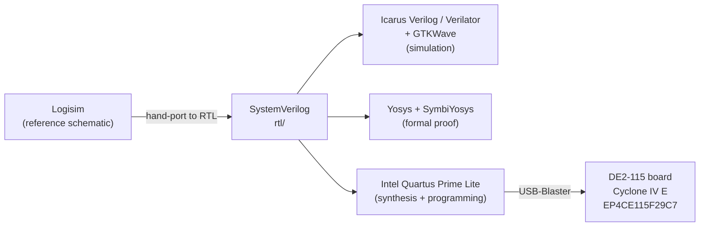

# Tooling

How to install and run the toolchain behind this 16-bit MIPS-like processor — the Logisim schematic that is the reference design, the Intel Quartus flow that targets the DE2-115 board, and the open-source simulation and formal stack used to verify the SystemVerilog. Written for Windows 11, since that is the author's environment.

> New here? The schematic in `logisim/Processador.circ` is the source of truth for behavior; the RTL under `rtl/` is being brought up module-by-module to match it. See [fpga-bringup.md](fpga-bringup.md) for the hardware plan and [verification.md](verification.md) for how the design is checked.

---

## Overview: which tool does what

The project spans four kinds of work — drawing/simulating the schematic, synthesizing to an FPGA, simulating the RTL, and formally proving properties. Each stage has its own tool.



| Tool | Purpose | Stage |
|------|---------|-------|
| Logisim (Evolution) | Open and run the reference schematic; load and step `loop.mem` | Design / reference |
| Intel Quartus Prime Lite | Synthesize the SystemVerilog and program the FPGA | Hardware |
| Icarus Verilog + GTKWave | Compile and run testbenches; view waveforms | Simulation |
| Verilator | Fast cycle-accurate simulation of the RTL | Simulation |
| Yosys + SymbiYosys | Formal verification (bounded model checking with SVA) | Formal |

> The exact version numbers and download URLs change over time. Where this page says "the official site" or "the project's releases page," go there for the current installer and instructions rather than trusting a hard-coded link.

---

## 1. Logisim — the reference schematic

The processor was originally designed and simulated in **Logisim 2.7.1 (classic)**. Classic Logisim is no longer maintained and can be awkward to run on modern operating systems (it depends on an old Java setup).

**Recommendation:** use **Logisim Evolution**, the actively maintained open-source fork. It opens the classic `.circ` format and runs on current Windows, macOS, and Linux. There is a small chance a classic circuit renders or behaves slightly differently in Evolution; if anything looks off, the original 2.7.1 remains the definitive reference for how the schematic was built.

### Install (Windows 11)

Logisim Evolution is a Java application, so you need a Java runtime first:

1. **Install a Java runtime** (a current LTS JDK/JRE is fine). Any recent OpenJDK build works.
2. **Get Logisim Evolution** from its official project releases page (it is distributed on GitHub as a runnable `.jar` and as platform installers). Download the latest release.
3. **Launch it** — either run the platform installer, or start the `.jar` (double-click, or `java -jar <the-jar-file>` from a terminal if double-click does not work).

If you specifically want the original tool, classic **Logisim 2.7.1** is still findable as an archived `.jar`; run it the same way (`java -jar`).

### Open the circuit

1. Launch Logisim Evolution.
2. **File → Open** and select `logisim/Processador.circ` (the main build). The two companion files — `Desenvolvendo.circ` (a development variant with the same sub-circuits rewired) and `Registrador.circ` (a standalone register experiment) — are there for reference and are not needed to run the CPU.
3. Use the circuit explorer on the left to move between the top-level datapath and the sub-circuits (register bank, ALU/ULA, control unit, clock sequencer).

### Poke the clock

The CPU is a **multicycle** design driven by a **5-phase clock sequencer** (a one-hot ring of 5 flip-flops). Every clock edge advances the machine through its phases, so "running" the processor means driving that clock.

- **Manual stepping** — select the **Poke tool** (the pointing-hand icon in the toolbar), then click the clock input to toggle it high/low by hand. This is the clearest way to watch one phase at a time and see the sequencer's one-hot output walk 1 → 2 → 3 → 4 → 5.
- **Automatic ticks** — use the **Simulate** menu to enable ticking (and to tick once, or set a tick frequency). Menu labels differ slightly between classic and Evolution, but the controls live under the Simulate menu in both. Make sure simulation is enabled so the flip-flops actually update.

Watch the ALU output register, the `ZERO` flag, and the phase outputs as you step; that is the quickest way to reacquaint yourself with the datapath.

### Load a program image into the instruction memory

Programs live in the instruction memory, which in the schematic is a **Logisim RAM component with a 4-bit address and 16-bit data — i.e. 16 words × 16 bits** (so a program is at most 16 instructions). Program files use Logisim's **`v2.0 raw`** memory-image format, which the tool reads natively.

To load the sample program:

1. In the top-level circuit, find the **instruction memory (RAM)** component.
2. **Right-click** it and choose **Load Image…**.
3. Select `logisim/programs/loop.mem`.

`loop.mem` is a 7-word `v2.0 raw` image:

```
v2.0 raw
0 112 221 8312 9032 240 e003
```

It demonstrates a nested-loop shape (a for-inside-a-while) built from `j`, `slt`, and `beqz`.

> **Decode caveat.** The exact instruction-by-instruction decode of `loop.mem` depends on the instruction-field endianness, which is **to be confirmed during RTL bring-up** (by co-simulating the Verilog testbench against the Logisim run). Until then, treat it as "a nested-loop demo using `slt` / `beqz` / `j`," not as a settled byte-by-byte listing. See [isa.md](isa.md) for the instruction format and the current status of that question.

After loading, use the Poke tool (or automatic ticks) as above to run the program. The top-level has a `Read Data` output and a 4-digit 7-segment display fed by an output-converter sub-circuit, which you can use to watch a register/result value as the loop runs.

---

## 2. Intel Quartus Prime Lite — FPGA synthesis and programming

**What it's for.** Quartus is Intel's FPGA design suite: it synthesizes the hand-written SystemVerilog, places and routes it for the target device, and programs the resulting bitstream onto the board. This project uses it to bring the RTL up on real hardware, module-by-module. It is not needed for pure simulation or formal work — only for getting the design onto the FPGA.

**Which edition.** Use the **Quartus Prime Lite Edition**, which is free. Download it from Intel's official FPGA software download site; the free edition typically requires a (free) Intel account to download.

**Target device.** The board is the **Altera/Intel DE2-115**, whose FPGA is a **Cyclone IV E, device EP4CE115F29C7**. When installing Quartus:

- The Lite installer lets you pick which **device family support** to include. Make sure **Cyclone IV E** is selected, or the toolchain will not be able to target this chip.
- Create the Quartus project against device **EP4CE115F29C7** so pin assignments and timing match the board.

**Programming the board — USB-Blaster.** The DE2-115 is programmed over Intel's **USB-Blaster** interface (the board provides it on-board; you connect it to the PC over USB). On Windows you must install the **USB-Blaster driver** so Quartus can see the board; the driver ships with Quartus and is pointed at through Windows Device Manager the first time the board is plugged in. Programming is then done from Quartus's **Programmer** tool, which detects the device over the USB-Blaster and loads the bitstream.

Full board bring-up — the recommended module-by-module order (ALU → register file → control unit → PC + instruction memory → data memory → 5-phase sequencer → integration), the SW/KEY/HEX/LEDR top wrappers, and on-hardware observation with SignalTap — is covered in **[fpga-bringup.md](fpga-bringup.md)**.

---

## 3. Open-source simulation and formal stack

These tools verify the SystemVerilog before (and alongside) FPGA bring-up. All are free and open-source. On Windows 11 you have two broad paths:

- **Native Windows** — Icarus Verilog and GTKWave both have Windows builds and are the easiest to install natively.
- **WSL2 (Ubuntu)** — Verilator and the Yosys/SymbiYosys formal stack are most comfortable on Linux. Running them under WSL2 on Windows 11 is often the smoothest route: you get the Linux packaging while keeping your files on the same machine. (Native Windows builds of these tools exist too, but WSL2 tends to save setup friction.)

Pick per tool below. When in doubt, WSL2 gives you a single environment where every tool in this section installs cleanly.

### Icarus Verilog + GTKWave (compile, simulate, view waveforms)

- **Icarus Verilog** (`iverilog`/`vvp`) compiles and runs Verilog/SystemVerilog testbenches. On Windows there is an official Windows installer; alternatively install it from your WSL2 distro's package manager.
- **GTKWave** opens the waveform dumps (`.vcd`/`.fst`) that a simulation writes, so you can inspect signals over time. Windows builds are available, and some Icarus Windows installers bundle GTKWave; under WSL2 install it from the package manager.

Typical loop: `iverilog` to build a testbench, `vvp` to run it (producing a waveform file), then GTKWave to view the result. The self-checking testbenches and exact commands live under `sim/`; see [verification.md](verification.md).

### Verilator (fast RTL simulation)

**Verilator** compiles synthesizable SystemVerilog into a fast C++/SystemC model — much faster than event-driven simulators for large or long-running tests. On Windows, install it inside **WSL2** (its native toolchain assumes a Unix-like environment); install from the distro's package manager, or build from source following the project's official instructions if you need a newer version than the packages provide.

### Yosys + SymbiYosys (formal verification)

Formal verification proves properties for **all** inputs at once, instead of trying cases one by one. This project uses **SymbiYosys (SBY)** — the front-end driver — on top of **Yosys** (synthesis/analysis) with **SystemVerilog Assertions (SVA)**, to check properties like "the sequencer is always one-hot" and "`slt` sets exactly 0 or 1." (More on the properties themselves in [verification.md](verification.md).)

Install approach on Windows:

- The simplest way to get **Yosys, SymbiYosys, and the SAT/SMT solvers** together is a prebuilt distribution from **YosysHQ** (their open-source CAD suite bundles all of these in one download). Get it from the project's official releases; there are builds for Windows as well as Linux.
- Alternatively, install the pieces under **WSL2** from packages or by building them, following each project's official instructions.

SymbiYosys reads a small `.sby` config that names the design, the properties, and the engine; the formal setup and configs live under `formal/`.

---

## Quick reference

| I want to… | Use | Notes |
|------------|-----|-------|
| Open and run the original design | Logisim Evolution | Opens `logisim/Processador.circ`; needs a Java runtime |
| Load a program and step it | Logisim Evolution | Right-click instruction RAM → **Load Image…** → `programs/loop.mem`; poke the clock |
| Put the design on the board | Quartus Prime Lite (free) | Device **EP4CE115F29C7**; program via **USB-Blaster** → see [fpga-bringup.md](fpga-bringup.md) |
| Run a testbench and view waves | Icarus Verilog + GTKWave | Native Windows builds available |
| Fast RTL simulation | Verilator | Easiest under WSL2 |
| Prove properties formally | Yosys + SymbiYosys | YosysHQ prebuilt suite, or WSL2 → see [verification.md](verification.md) |

---

*Part of the documentation set for the 16-bit MIPS-like processor. Related: [fpga-bringup.md](fpga-bringup.md) · [verification.md](verification.md) · [isa.md](isa.md).*
