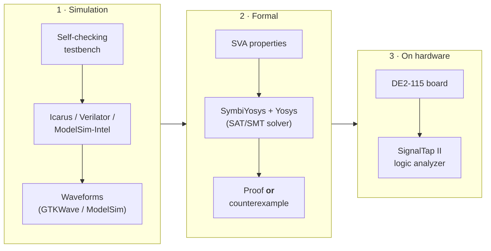

# Verification Strategy

*How we gain confidence that the 16-bit MIPS-like CPU does what the design says — through simulation, formal proof, and on-hardware capture.*

Verification is the discipline of checking that the register-transfer-level (RTL) implementation actually matches the intended behavior described in the [project README](../README.md) and the [ISA](isa.md). This CPU is a **multicycle** design driven by a **5-phase clock sequencer**, with a 16-bit word, a fixed 16-bit instruction width, and 16 general-purpose registers. Those facts shape everything below.

We use three complementary layers. Each one catches a different class of mistake, and no single layer is sufficient on its own.



The recommended path is to verify **module by module**, in the same order used for FPGA bring-up (ALU → register file → control unit → PC + instruction memory → data memory → 5-phase sequencer → full datapath → apps). Small, isolated blocks are far easier to test and to prove correct than the whole datapath at once. See [fpga-bringup.md](fpga-bringup.md) for the board side of this workflow.

---

## 1. Simulation

Simulation runs the RTL against input vectors you choose and observes what comes out. It is fast, flexible, and the natural first step for every module.

### Self-checking testbenches

A **self-checking** testbench does not just print signals for a human to eyeball — it computes the *expected* answer itself and asserts equality, failing loudly on any mismatch. The pattern is:

1. Drive a stimulus (operands, opcode, clock phases).
2. Compute the expected result in the testbench (a small reference model, or a hand-written golden value).
3. Compare DUT output against expected; on mismatch, print the offending case and set an error flag.
4. At the end, print a single `PASS` / `FAIL` line.

This makes a test run trustworthy in CI and in a script, because success is a machine-checkable condition rather than a waveform someone has to interpret.

A particularly valuable self-check for this project is **co-simulation against the Logisim run**: feed the same program (for example `loop.mem`) to both the Logisim circuit and the RTL, and compare register/memory state step by step. The brief flags several details as **to be confirmed during RTL bring-up** — notably the instruction-field endianness and the exact byte-by-byte decode of `loop.mem` — and this co-simulation is exactly how those get resolved.

### Tools

| Tool | Role | Notes |
|------|------|-------|
| **Icarus Verilog** (`iverilog`) | Open-source event-driven simulator | Great for quick, scriptable module tests; compiles Verilog/SystemVerilog subset. |
| **Verilator** | Open-source cycle-based compiler to C++ | Very fast for large/long simulations; excellent for regression runs. |
| **ModelSim-Intel** | Vendor simulator bundled with Quartus | Matches the Intel/Altera FPGA toolchain used for the target board. |

Using more than one simulator is a cheap way to catch tool-specific quirks and non-portable RTL.

### Waveform viewing

When a self-check fails, you need to *see* the signals to diagnose why. Two viewers pair naturally with the tools above:

- **GTKWave** — opens the `.vcd` / `.fst` dumps produced by Icarus Verilog and Verilator.
- **ModelSim** — has its own integrated waveform window.

Waveforms are a debugging aid, not the pass/fail judge. The judge is always the self-check.

---

## 2. A gentle primer on formal verification

Formal verification is often the part learners find mysterious, so here is the intuition first.

### Simulation vs. formal: the core contrast

**Simulation** answers the question *"for the specific inputs I tried, was the output correct?"* If you test the ALU with a hundred operand pairs and they all pass, you know those hundred cases work. You know nothing about the case you forgot to try. With 16-bit operands there are billions of input combinations, so exhaustive simulation is out of the question.

**Formal verification** answers a stronger question: *"is this property true for **all** possible inputs and states?"* Instead of trying inputs one at a time, a mathematical solver treats the inputs as symbolic (they can be *anything*) and searches for **any** assignment that would violate the property. If it finds one, it hands you a concrete counterexample trace. If it proves none can exist, the property holds universally.

> Think of simulation as sampling the space by hand, and formal as a solver reasoning over the entire space at once.

### Bounded model checking (BMC)

The most approachable formal technique is **bounded model checking**. Starting from reset, BMC unrolls the design for a fixed number of clock cycles *k* and asks the solver: *"within these k cycles, is there any input sequence that breaks the property?"*

- If the solver says **unsatisfiable**, the property holds for every trace up to depth *k*.
- If it says **satisfiable**, it returns the exact input sequence — a waveform you can load and study.

Be honest about the "bounded" part: **BMC only proves the property up to depth k.** A bug that first appears at cycle *k + 1* would be missed. To reach an *unbounded* proof you use **k-induction** (SymbiYosys `mode prove`), which proves that if the property holds for *k* consecutive steps it also holds for the next one — closing the gap that BMC leaves open. For this multicycle CPU, a depth that comfortably covers a few full 5-phase instruction cycles is a sensible starting bound.

### The toolchain: SymbiYosys + Yosys + SVA

Three pieces work together in the open-source flow:

- **SystemVerilog Assertions (SVA)** — the language you write properties in, embedded alongside the RTL.
- **Yosys** — the open-source synthesis tool that reads the RTL and the assertions and turns them into a formal representation the solver understands.
- **SymbiYosys (SBY)** — the front-end that orchestrates the whole run: it drives Yosys, hands the problem to a solver (via `smtbmc`), and reports pass/fail plus any counterexample.

A minimal `.sby` job file looks like this:

```ini
[options]
mode bmc          # or: prove  (k-induction, unbounded)
depth 20          # unroll 20 cycles

[engines]
smtbmc            # SMT-based bounded model checker

[script]
read -formal alu.sv
prep -top alu

[files]
alu.sv
```

### assume / assert / cover

These three keywords are the vocabulary of a formal property:

| Keyword | Meaning | Mental model |
|---------|---------|--------------|
| **`assert`** | *This must always be true.* The solver tries to prove it, or find a counterexample. | The obligation you are checking. |
| **`assume`** | *Treat this as a given about the environment.* The solver only considers inputs that satisfy it. | The contract you require of the outside world. |
| **`cover`** | *Find some trace where this happens.* Proves a situation is reachable. | A sanity check that the scenario can even occur. |

A word of caution about `assume`: it constrains what the solver explores. If you assume too much (over-constraining), you may "prove" a property only because you quietly excluded the very inputs that would break it. Use `cover` to confirm that the interesting cases are still reachable under your assumptions.

### What formal does — and does not — give you

This is the most important honesty note in this document:

> **Formal verification proves the specific properties you write, not "total correctness."**

A green result means *"every property I stated holds."* It says nothing about behaviors you never described. If your assertions are incomplete, or an `assume` is too strong, or an assertion passes *vacuously* (its precondition is never satisfied), you can get a proof that is technically valid yet gives false comfort. Formal is a powerful amplifier of a *good specification* — it is not a substitute for thinking carefully about what "correct" means for this CPU.

---

## 3. Concrete properties for this CPU

Below are the properties worth proving for this design, drawn directly from the brief. They map cleanly onto the module-by-module plan.

> **Note on signal names.** The RTL has not been written yet, so the identifiers below (`ulaop`, `ula_result`, `phase`, `pc`, `clock_wb`, …) are **illustrative placeholders** chosen to echo the schematic labels (ULAOP, ULA RESULT, ClockWB, …). Align them to the actual port names when the RTL exists — that alignment itself is part of bring-up.

| # | Property | Module | Layer(s) |
|---|----------|--------|----------|
| 1 | ALU result matches a reference model | ALU (ULA) | formal + sim |
| 2 | `slt` yields exactly 0 or 1 | ALU (ULA) | formal |
| 3 | 5-phase sequencer state is always one-hot | Sequencer | formal |
| 4 | PC changes only by +1 or to a valid target | PC / next-PC MUX | formal |
| 5 | Register-file read-after-write returns the written value | Register file | formal |

### 3.1 ALU result matches a reference model

For the combinational operations, the ALU output should equal an independent reference expression selected by `ULAOP` (encoding from the brief: `000` add, `001` subtract, `100` set-less-than, `101` subtract-for-ZERO, etc.).

```systemverilog
// Illustrative names — align to the real RTL during bring-up.
// When told to add, the result equals the reference sum.
assert property (@(posedge clk) ulaop == 3'b000 |-> ula_result == (dado1 + dado2));

// When told to subtract, the result equals the reference difference.
assert property (@(posedge clk) ulaop == 3'b001 |-> ula_result == (dado1 - dado2));
```

Multiply (`010`) and divide (`011`) deserve special care: the brief notes they **cannot complete in a single clock in real hardware**. In Logisim the built-in arithmetic blocks resolve in one step, but on the FPGA multiply may become combinational (DSP blocks) and divide likely becomes iterative/multi-cycle. For a multi-cycle unit, gate the check on a `done` signal rather than asserting the result on the same cycle:

```systemverilog
// For an iterative divider: only check once the unit signals completion.
assert property (@(posedge clk) (ulaop == 3'b011 && div_done)
                                 |-> ula_result == (dado1 / dado2));
```

### 3.2 `slt` produces exactly 0 or 1

The brief defines `slt RD, RX, RY : RD = (RX < RY) ? 1 : 0`. Two assertions capture this — a shape check and a value check:

```systemverilog
// Shape: the result is exactly 0 or 1, nothing else.
assert property (@(posedge clk) ulaop == 3'b100
                                 |-> (ula_result == 16'd0 || ula_result == 16'd1));

// Value: it agrees with a reference comparison.
// [TO-VERIFY] signed vs. unsigned "A<Y" — the schematic shows a magnitude
// comparator with a sign-extend; confirm the signedness during RTL bring-up.
assert property (@(posedge clk) ulaop == 3'b100
                                 |-> ula_result == ((dado1 < dado2) ? 16'd1 : 16'd0));
```

### 3.3 The 5-phase sequencer is always one-hot

The sequencer is a ring of 5 D-flip-flops with a reset AND-gate, producing 5 non-overlapping phases. "One-hot" means exactly one phase bit is high at any time — a natural, high-value invariant:

```systemverilog
// Outside of reset, exactly one of the 5 phase bits is active.
assert property (@(posedge clk) disable iff (reset) $onehot(phase));

// Sanity (cover): the sequencer actually reaches phase 5 (write-back).
cover property (@(posedge clk) phase == 5'b10000);
```

If the ring ever glitched to all-zeros or two-hot, this assertion would produce a counterexample immediately — the kind of state-machine fault that is painful to find in simulation but trivial for a solver.

### 3.4 PC changes only by +1 or to a valid target

The brief states PC defaults to `PC + 1`, and on `j` or on `beqz` with `ZERO = 1` it loads the target from the 4-bit `I` field. Because that field is only 4 bits and instruction memory holds exactly 16 words, **any target is a valid instruction address by construction** (range 0..15). Check the PC at the point where it is updated:

```systemverilog
// pc_update marks the cycle the PC commits (phase-5 PC clock).
// [TO-VERIFY] the exact phase at which jump/branch commit the new PC.
assert property (@(posedge clk) disable iff (reset)
    pc_update |=> (pc == $past(pc) + 16'd1)      // sequential
               || (pc == $past(next_target)));   // jump / taken branch

// Sanity (cover): a branch can actually be taken.
cover property (@(posedge clk) branch && zero);
```

### 3.5 Register-file read-after-write

If a value is written to some register via `ClockWB`, a later read of that same register (with no intervening write to it) must return the value written. The classic formal technique uses a *symbolic* register index and a shadow copy:

```systemverilog
(* anyconst *) reg [3:0] k;   // an arbitrary but fixed register index
reg [15:0] shadow;
reg        tracked;

always @(posedge clk) begin
  if (reset) tracked <= 1'b0;
  else if (clock_wb && rd == k) begin   // a write-back targeting register k
    shadow  <= wb_data;
    tracked <= 1'b1;
  end
end

// Once k has been written, reading it back (via the RX read port) matches.
assert property (@(posedge clk)
    tracked && (rx == k) |-> (read_port_x == shadow));
```

Because `k` is `anyconst`, the solver proves this for *every* register at once, not just one you picked. An `assume` can constrain the environment where useful — for example, restricting the opcode to the defined range (E and F are reserved):

```systemverilog
assume property (@(posedge clk) opcode <= 4'hD);
```

---

## 4. On-hardware verification with SignalTap II

Simulation and formal both reason about the *model*. The final layer checks the *real silicon* on the target board (Intel/Altera DE2-115, Cyclone IV E, device EP4CE115F29C7).

**SignalTap II** is the embedded logic analyzer built into Quartus Prime. It synthesizes a small capture core alongside your design, samples chosen internal signals into on-chip memory on a trigger condition, and streams the captured window back to the Quartus GUI over JTAG — effectively a waveform view of signals *inside the running FPGA*.

Typical uses for this CPU:

- Watch the 5 phase signals and confirm the one-hot sequence advances as expected on real clocks.
- Trigger on a `beqz`/`j` and capture the PC around the branch to confirm the taken/not-taken target.
- Capture `ClockWB`, `RD`, and the write-back datum to confirm a register actually latches on hardware.
- Run `loop.mem` and observe loop counters, complementing the LEDR/HEX board demos.

SignalTap catches problems the model cannot: timing that does not close, pin-assignment mistakes, and clocking issues that only appear on the physical [board bring-up](fpga-bringup.md).

---

## Summary

| Layer | Proves | Blind spot |
|-------|--------|------------|
| **Simulation** | The inputs you tried behave correctly | Cases you did not try |
| **Formal** | The properties you wrote hold for *all* inputs (to depth *k*, or unbounded with induction) | Behaviors you never specified |
| **On-hardware** | The physical FPGA behaves as intended | Only what you triggered and captured |

Use all three. Simulation gives fast, broad coverage of realistic scenarios; formal turns your most important invariants into universal guarantees; SignalTap confirms the design survives contact with real hardware. Together they build well-founded confidence — while each remains honest about what it does not check.

---

### See also

- [README](../README.md) — project overview
- [ISA](isa.md) — instruction set and encoding
- [FPGA bring-up](fpga-bringup.md) — module-by-module board workflow and SignalTap setup
